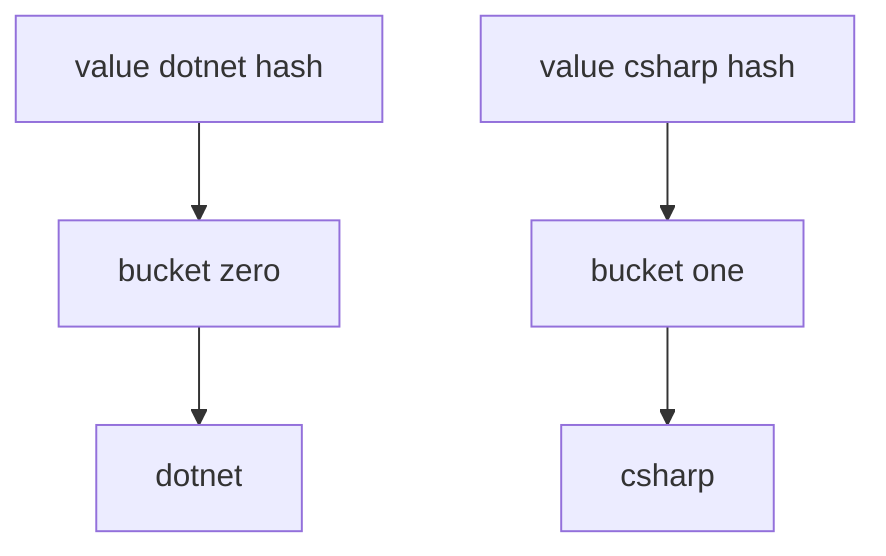

---
{"dg-publish":true,"permalink":"/software-engineering/02-computer-science/data-structures/hash-set/"}
---


# Intro

`HashSet<T>` stores unique values with fast membership checks. Use it when uniqueness and lookup speed matter more than ordering.

## Deeper Explanation

`HashSet<T>` is hash-based and uses `GetHashCode` plus `Equals` to enforce uniqueness.
Its core operations (`Add`, `Contains`, `Remove`) are O(1) on average.

## Structure



### Example

```csharp
var tags = new HashSet<string>(StringComparer.OrdinalIgnoreCase)
{
    "dotnet",
    "csharp"
};

var added = tags.Add("DOTNET"); // false, already exists by comparer
```

### Pitfalls

- Overriding `Equals` without matching `GetHashCode` breaks set behavior.
- Mutating fields that participate in hash/equality after insertion can make entries unreachable.
- Enumeration order is not a stable contract.

### Tradeoffs

- Use `HashSet<T>` for fast uniqueness checks.
- Use `SortedSet<T>` if you need sorted uniqueness and accept O(log n) operations.

## Questions

> [!QUESTION]- What is the difference between `HashSet<T>` and `List<T>` for membership checks?
> `HashSet<T>.Contains` is O(1) average; `List<T>.Contains` is O(n).

> [!QUESTION]- Why can `HashSet<T>.Contains` fail for logically equal objects?
> Because hash/equality contracts are broken (for example, mismatched `GetHashCode`).

## Hash-Based Collections Comparison

| Type | Stores | Thread-safe | When to use |
|---|---|---|---|
| `HashSet<T>` | Values only | No | Unique membership checks, set operations |
| `Dictionary<TKey,TValue>` | Key-value pairs | No | Key-based lookup |
| `SortedSet<T>` | Values only | No | Sorted uniqueness, O(log n) ops |

**Decision rule**: use `HashSet<T>` when you only need to track membership or perform set operations (union, intersect, except). Use `Dictionary` when you need to associate a value with each key.

## Links

- [HashSet<T> class](https://learn.microsoft.com/en-us/dotnet/api/system.collections.generic.hashset-1) — API reference with set operation methods (UnionWith, IntersectWith, ExceptWith).
- [ISet<T> interface](https://learn.microsoft.com/en-us/dotnet/api/system.collections.generic.iset-1) — interface contract for set semantics; useful for abstracting over HashSet and SortedSet.
- [Collections overview and complexity](https://learn.microsoft.com/en-us/dotnet/standard/collections/) — Microsoft overview of all collection types with complexity guidance.
- [HashSet implementation in dotnet runtime](https://github.com/dotnet/runtime/blob/main/src/libraries/System.Private.CoreLib/src/System/Collections/Generic/HashSet.cs) — source code for internal bucket and slot layout.

<!-- whats-next:start -->

---

> [!note] Whats next
> **Parent**
>  [[Software Engineering/02 Computer Science/02 Computer Science\|02 Computer Science]]
>
> **Pages**
> - [[Software Engineering/02 Computer Science/Data Structures/Dictionary\|Dictionary]]
> - [[Software Engineering/02 Computer Science/Data Structures/Graph\|Graph]]
> - [[Software Engineering/02 Computer Science/Data Structures/HashMap\|HashMap]]
> - [[Software Engineering/02 Computer Science/Data Structures/Hashtable\|Hashtable]]
> - [[Software Engineering/02 Computer Science/Data Structures/Heap\|Heap]]
> - [[Software Engineering/02 Computer Science/Data Structures/LinkedList\|LinkedList]]
> - [[Software Engineering/02 Computer Science/Data Structures/List\|List]]
> - [[Software Engineering/02 Computer Science/Data Structures/Queue\|Queue]]
> - [[Software Engineering/02 Computer Science/Data Structures/Span\|Span]]
> - [[Software Engineering/02 Computer Science/Data Structures/Stack\|Stack]]
> - [[Software Engineering/02 Computer Science/Data Structures/Trees\|Trees]]
<!-- whats-next:end -->
