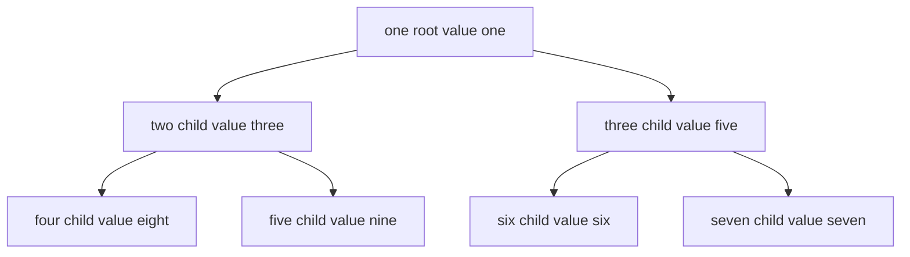

---
{"dg-publish":true,"permalink":"/software-engineering/02-computer-science/data-structures/heap/","noteIcon":"1"}
---


# Intro

A heap is an implicit complete d ary tree that keeps a priority rule between parent and child nodes. In a min heap, the smallest value is always at the root, so extracting the next priority item stays fast. In .NET, `PriorityQueue<TElement, TPriority>` is implemented as an array backed quaternary heap that gives fast enqueue and dequeue for scheduler and path finding workloads.

## Deeper Explanation

Heaps are not globally sorted like a list. They only guarantee local ordering between parent and children, which is enough to keep the best candidate at the top.

- `Enqueue` inserts at the end, then bubbles up to restore heap order.
- `Dequeue` removes the root, moves the last item to root, then pushes it down.
- Both operations are O(log n), while peeking root is O(1).

## Structure



### Example

```csharp
var pq = new PriorityQueue<string, int>();

pq.Enqueue("critical", 1);
pq.Enqueue("normal", 5);
pq.Enqueue("high", 2);

Console.WriteLine(pq.Dequeue()); // critical
Console.WriteLine(pq.Peek());    // high
```

### Pitfalls

- Assuming full sort order is incorrect. Only root priority is guaranteed, so iterating a heap does not return sorted output.
- Mixing priority direction causes silent logic bugs. In .NET lower `TPriority` values are dequeued first, so invert priority intentionally if you need max first behavior.
- Mutable priority data can make queue semantics confusing. If priority changes after enqueue, remove and reinsert instead of mutating external state and expecting reheapify.

### Tradeoffs

- Heap vs sorted set: heaps are better for repeated best item extraction, sorted sets are better when you need ordered iteration.
- Heap vs list sort per batch: heaps are better for incremental arrivals, sorting a list can be simpler when all data is already known.

## Questions

> [!QUESTION]- Why is `Dequeue` on a heap O(log n) instead of O(1)?
> Removing the root breaks heap order. The last node is moved to root and then pushed down through tree levels, which is bounded by tree height.

> [!QUESTION]- Why can heap iteration look unsorted even when the structure is valid?
> A heap guarantees only parent child ordering, not full in order traversal across siblings and cousins.

> [!QUESTION]- What is the practical reason to use `PriorityQueue<TElement, TPriority>` in .NET?
> It gives efficient dynamic priority scheduling without resorting full collections after each insert.

## Links

- [PriorityQueue TElement TPriority class](https://learn.microsoft.com/en-us/dotnet/api/system.collections.generic.priorityqueue-2)
- [Collections and data structures](https://learn.microsoft.com/en-us/dotnet/standard/collections/)
- [PriorityQueue source in dotnet runtime](https://github.com/dotnet/runtime/blob/main/src/libraries/System.Collections/src/System/Collections/Generic/PriorityQueue.cs)

<!-- whats-next:start -->

---

> [!note] Whats next
> **Parent**
>  [[Software Engineering/02 Computer Science/02 Computer Science\|02 Computer Science]]
>
> **Pages**
> - [[Software Engineering/02 Computer Science/Data Structures/Dictionary\|Dictionary]]
> - [[Software Engineering/02 Computer Science/Data Structures/Graph\|Graph]]
> - [[Software Engineering/02 Computer Science/Data Structures/HashMap\|HashMap]]
> - [[Software Engineering/02 Computer Science/Data Structures/HashSet\|HashSet]]
> - [[Software Engineering/02 Computer Science/Data Structures/Hashtable\|Hashtable]]
> - [[Software Engineering/02 Computer Science/Data Structures/LinkedList\|LinkedList]]
> - [[Software Engineering/02 Computer Science/Data Structures/List\|List]]
> - [[Software Engineering/02 Computer Science/Data Structures/Queue\|Queue]]
> - [[Software Engineering/02 Computer Science/Data Structures/Span\|Span]]
> - [[Software Engineering/02 Computer Science/Data Structures/Stack\|Stack]]
> - [[Software Engineering/02 Computer Science/Data Structures/Trees\|Trees]]
<!-- whats-next:end -->
