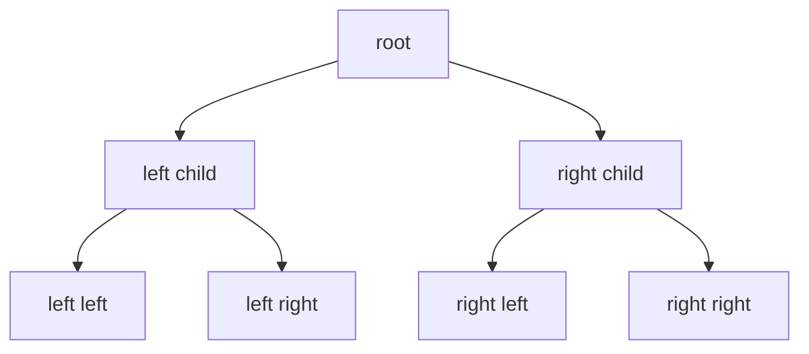

---
{"dg-publish":true,"permalink":"/software-engineering/02-computer-science/data-structures/trees/"}
---


# Intro

Trees represent hierarchical data with parent-child relationships. In .NET, tree-like behavior commonly appears through `SortedSet<T>`, custom recursive node models, and expression trees in the compiler pipeline.

## Deeper Explanation

A tree organizes nodes so each node has at most one parent (except the root) and any number of children. Balanced trees keep height at O(log n), making insert, delete, and search O(log n). Unbalanced trees degrade toward O(n) — inserting already-sorted values into a naïve BST produces a linked list.

**Traversal orders** define processing sequence:

- *Pre-order* (root → left → right): used to serialize or copy a tree.
- *In-order* (left → root → right): visits nodes in sorted order for a BST — the basis for `SortedSet<T>` enumeration.
- *Post-order* (left → right → root): used when children must be processed before parents, such as deleting a subtree or evaluating an expression tree.
- *BFS (level-order)*: uses a `Queue<T>` to visit nodes level by level, natural for shortest-path in unweighted trees.

`SortedSet<T>` in .NET uses a red-black tree internally, guaranteeing O(log n) insert and lookup regardless of insertion order.

## Structure



### Example

```csharp
var ids = new SortedSet<int> { 5, 1, 3, 3 };
// Stored sorted and unique: 1, 3, 5
```

### Pitfalls

- Recursive traversals can overflow the stack on very deep trees.
- Tree node objects can increase GC pressure at very large sizes.
- Unbalanced insert patterns can degrade naive tree implementations.

### Tradeoffs

- `SortedSet<T>` gives sorted uniqueness with O(log n) operations.
- Flat arrays/lists can be faster for simple one-time sorting and scan workloads.

## Questions

> [!QUESTION]- Which built-in .NET collection is closest to a self-balancing tree?
> `SortedSet<T>` (and `SortedDictionary<TKey, TValue>` for key-value scenarios).

> [!QUESTION]- When would you avoid recursive tree traversal?
> On unknown/deep depth, where iterative traversal with an explicit stack is safer.

## Links

- [SortedSet<T> class](https://learn.microsoft.com/en-us/dotnet/api/system.collections.generic.sortedset-1) — API reference for the closest built-in self-balancing tree in .NET.
- [Sorted collection types](https://learn.microsoft.com/en-us/dotnet/standard/collections/sorted-collection-types) — Microsoft overview of SortedSet, SortedDictionary, and SortedList with complexity comparison.
- [Traverse a binary tree with parallel tasks](https://learn.microsoft.com/en-us/dotnet/standard/parallel-programming/how-to-traverse-a-binary-tree-with-parallel-tasks) — example of parallel tree traversal using Task Parallel Library.
- [SortedSet implementation in dotnet runtime](https://github.com/dotnet/runtime/blob/main/src/libraries/System.Collections/src/System/Collections/Generic/SortedSet.cs) — source code for the red-black tree backing SortedSet<T>.

<!-- whats-next:start -->

---

> [!note] Whats next
> **Parent**
>  [[Software Engineering/02 Computer Science/02 Computer Science\|02 Computer Science]]
>
> **Pages**
> - [[Software Engineering/02 Computer Science/Data Structures/Dictionary\|Dictionary]]
> - [[Software Engineering/02 Computer Science/Data Structures/Graph\|Graph]]
> - [[Software Engineering/02 Computer Science/Data Structures/HashMap\|HashMap]]
> - [[Software Engineering/02 Computer Science/Data Structures/HashSet\|HashSet]]
> - [[Software Engineering/02 Computer Science/Data Structures/Hashtable\|Hashtable]]
> - [[Software Engineering/02 Computer Science/Data Structures/Heap\|Heap]]
> - [[Software Engineering/02 Computer Science/Data Structures/LinkedList\|LinkedList]]
> - [[Software Engineering/02 Computer Science/Data Structures/List\|List]]
> - [[Software Engineering/02 Computer Science/Data Structures/Queue\|Queue]]
> - [[Software Engineering/02 Computer Science/Data Structures/Span\|Span]]
> - [[Software Engineering/02 Computer Science/Data Structures/Stack\|Stack]]
<!-- whats-next:end -->
