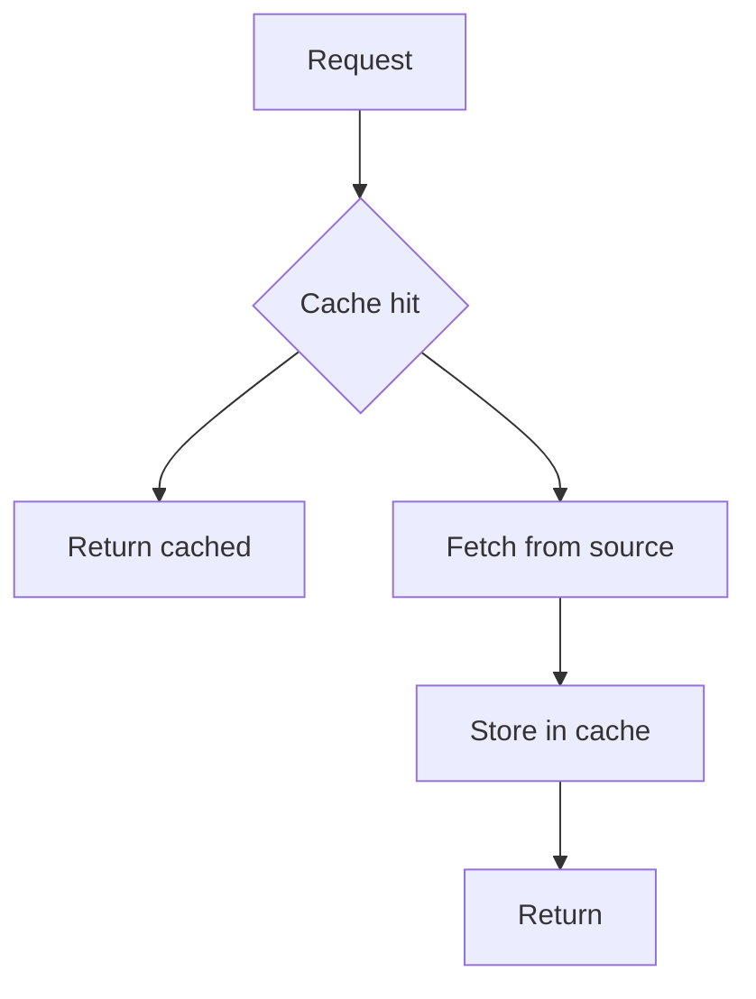
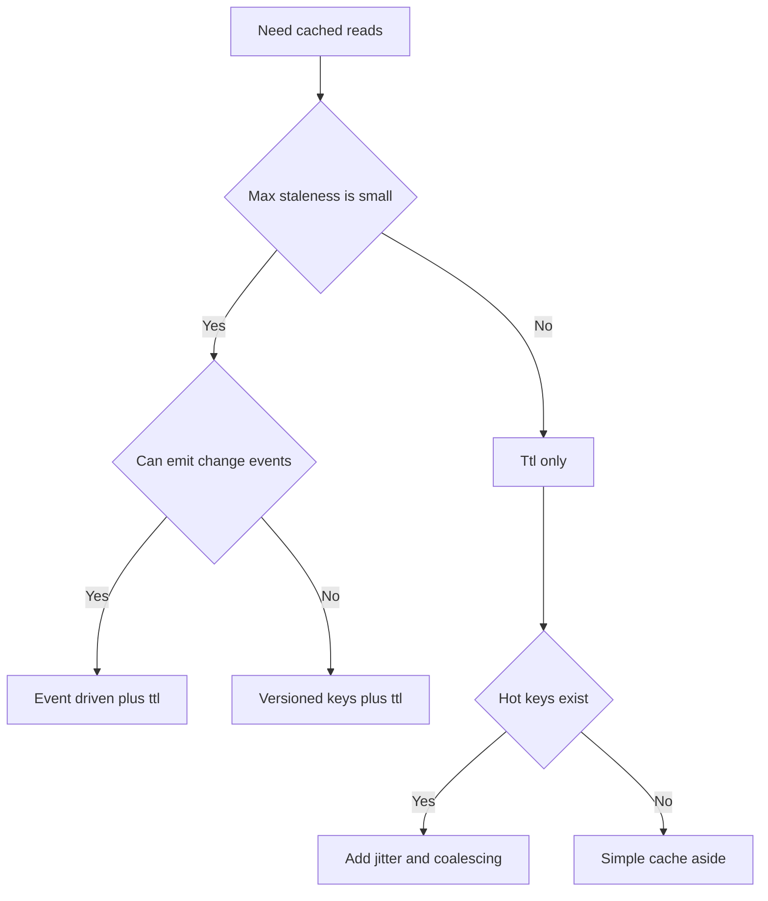
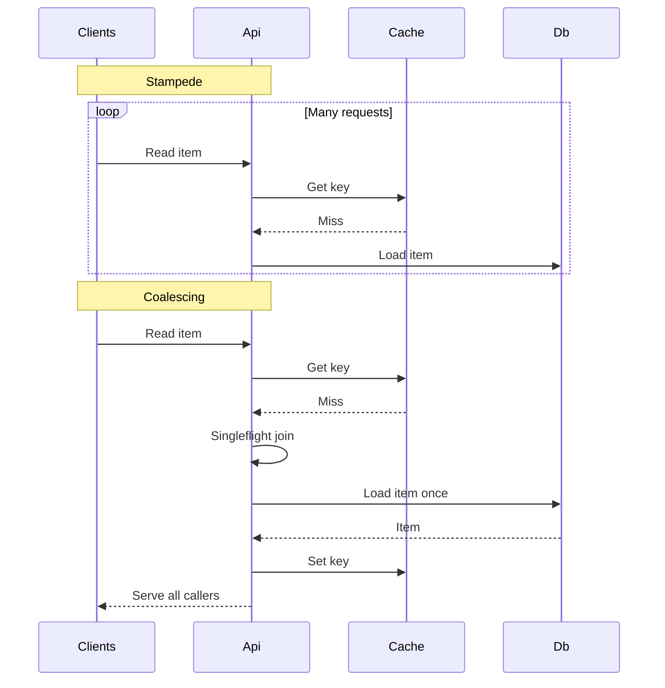

---
{"dg-publish":true,"permalink":"/software-engineering/03-data-persistence/caching/","noteIcon":"1"}
---


# Intro

Caching stores a copy of data closer to where it is used to reduce latency and load on the primary system.
You reach for it when the same data is requested frequently or when the primary data store is expensive or slow.

## Deeper Explanation

### Mental Model



Common patterns:

- Cache aside: app reads and writes the cache explicitly
- Read through and write through: cache layer does it for you
- Write behind: cache writes to source asynchronously (riskier)

### Example

Cache aside with `IDistributedCache`:

```csharp
public static async Task<string> GetUserName(
    string userId,
    IDistributedCache cache,
    Func<string, Task<string>> loadFromDb,
    CancellationToken ct)
{
    var key = $"user-name:{userId}";
    var cached = await cache.GetStringAsync(key, ct);
    if (cached is not null)
        return cached;

    var value = await loadFromDb(userId);
    await cache.SetStringAsync(
        key,
        value,
        new DistributedCacheEntryOptions { AbsoluteExpirationRelativeToNow = TimeSpan.FromMinutes(5) },
        ct);
    return value;
}
```

### Invalidation Strategies

Invalidation strategy is a correctness decision, not an optimization detail. Start by writing down your staleness contract, then pick the simplest strategy that meets it.

- TTL based: best when stale reads are acceptable and updates are infrequent or hard to observe
- Event driven: best when correctness matters and you can reliably emit change events
- Versioned keys: best when deletes are expensive or unreliable, and you can carry a version token
- Explicit delete: best when all writes go through one path that can delete or update cache

Common options:

- Explicit delete on write
  - On successful write, delete `key` or write the new value
  - If deletes can be lost, you still need a TTL as a safety net
- TTL only
  - Choose TTL from a staleness budget, not from guesswork
  - Add jitter and stampede protection for hot keys
- Event driven
  - Publish invalidation events on writes, consume them in all app instances
  - Typical transports: message broker pub sub, database change data capture, outbox pattern
  - If you cannot guarantee delivery, treat events as best effort and keep TTL
- Versioned keys
  - Key includes a version, for example `user-name:{userId}:v{version}`
  - Version comes from row version, updated at, etag, or a separate version store
  - Old keys naturally age out by TTL, no delete required

Decision rule of thumb:



### Correctness and Staleness

Treat cached data as a replica with its own consistency model.

- Staleness budget: the maximum age or divergence your product can tolerate, per data type
  - Example: prices might need seconds, user avatars can tolerate hours
- Eventual vs strong consistency
  - TTL only and best effort invalidation are eventual consistency
  - Strong consistency usually means bypassing cache or coupling cache and source writes in the same correctness boundary
- Read your writes
  - For user facing writes, ensure the writer reads fresh data immediately after writing
  - Common patterns: write through cache, delete on write, versioned key using row version, per request bypass for the writer
- Stale while revalidate
  - Serve slightly stale data fast while refreshing in the background
  - This trades bounded staleness for predictable latency and load

Concrete stale while revalidate example using `IDistributedCache`:

```csharp
using System.Text.Json;
using Microsoft.Extensions.Caching.Distributed;

public static class SwrCache
{
    private sealed record Envelope<T>(T Value, DateTimeOffset FreshUntilUtc);

    public static async Task<T> GetOrRefreshAsync<T>(
        string key,
        IDistributedCache cache,
        TimeSpan softTtl,
        TimeSpan hardTtl,
        Func<CancellationToken, Task<T>> load,
        Func<string, Task> revalidateInBackground,
        CancellationToken ct)
    {
        var now = DateTimeOffset.UtcNow;
        var json = await cache.GetStringAsync(key, ct);

        if (json is not null)
        {
            var envelope = JsonSerializer.Deserialize<Envelope<T>>(json);
            if (envelope is not null)
            {
                if (now <= envelope.FreshUntilUtc)
                    return envelope.Value;

                // Soft expired: serve stale value and trigger refresh.
                // Use a real background queue in production, not Task Run.
                _ = Task.Run(() => revalidateInBackground(key));
                return envelope.Value;
            }
        }

        // Hard miss: block and refill.
        var value = await load(ct);
        await WriteAsync(key, value, cache, softTtl, hardTtl, ct);
        return value;
    }

    public static async Task RevalidateAsync<T>(
        string key,
        IDistributedCache cache,
        TimeSpan softTtl,
        TimeSpan hardTtl,
        Func<CancellationToken, Task<T>> load,
        CancellationToken ct)
    {
        var value = await load(ct);
        await WriteAsync(key, value, cache, softTtl, hardTtl, ct);
    }

    private static Task WriteAsync<T>(
        string key,
        T value,
        IDistributedCache cache,
        TimeSpan softTtl,
        TimeSpan hardTtl,
        CancellationToken ct)
    {
        var envelope = new Envelope<T>(value, DateTimeOffset.UtcNow.Add(softTtl));
        var json = JsonSerializer.Serialize(envelope);
        return cache.SetStringAsync(
            key,
            json,
            new DistributedCacheEntryOptions { AbsoluteExpirationRelativeToNow = hardTtl },
            ct);
    }
}
```

Usage sketch:

```csharp
var value = await SwrCache.GetOrRefreshAsync(
    key: $"user-profile:{userId}",
    cache,
    softTtl: TimeSpan.FromSeconds(30),
    hardTtl: TimeSpan.FromMinutes(5),
    load: ct => LoadUserProfileFromDb(userId, ct),
    revalidateInBackground: k => SwrCache.RevalidateAsync(
        k,
        cache,
        softTtl: TimeSpan.FromSeconds(30),
        hardTtl: TimeSpan.FromMinutes(5),
        load: ct => LoadUserProfileFromDb(userId, ct),
        ct: CancellationToken.None),
    ct);
```

Notes:

- Soft TTL is a latency contract. Hard TTL is a safety contract.
- `IDistributedCache` does not give you atomic singleflight across instances. Pair SWR with stampede protection for hot keys.

### Cache Stampede

Cache stampede, also called thundering herd or dogpile, happens when many requests miss at once and all recompute the same expensive value.
The result is a short burst that can overwhelm your database or downstream service, often right when the cache is least helpful.

Mitigations:

- Add jitter to TTL
  - Randomize expirations so hot keys do not all expire at the same second
- Request coalescing
  - Singleflight pattern: one in flight load per cache key, everyone else awaits the same task
- Lock based fetch
  - Only the lock holder recomputes and refills the cache
  - Requires a backend that supports atomic lock semantics, for example Redis
- Background refresh
  - Proactively refresh hot keys before they expire, or use stale while revalidate

Stampede vs coalescing sketch:



### Pitfalls

- Cache poisoning
  - Key includes untrusted input, missing tenant boundary, or cache stores error responses
  - Mitigation: strict key design, include auth and tenant scope, do not cache failures unless explicitly modeled
- Unbounded growth
  - High cardinality keys, missing expirations, or versioned keys without TTL
  - Mitigation: enforce TTL, cap key space, monitor memory and evictions
- Serialization cost and format drift
  - Large payloads and frequent (de)serialization can dominate latency, and schema changes can break old entries
  - Mitigation: cache smaller projections, version the cached envelope, measure CPU and payload size
- Cold start after deploy
  - Restart or rollout wipes in memory caches and can amplify load on the source
  - Mitigation: distributed cache for shared warm state, background warmup for hot keys, gradual rollout
- Distributed cache partition and partial outages
  - Network split can cause a fleet wide miss storm or inconsistent reads
  - Mitigation: timeouts, circuit breaker, fallback to source with rate limiting, avoid coupling correctness to cache
- Negative caching without care
  - Caching not found can hide newly created data and extend user visible inconsistency
  - Mitigation: short TTL for negatives, invalidate on create
- Cache key design mistakes
  - Missing locale, permissions, feature flags, or query parameters leads to serving wrong content
  - Mitigation: deterministic key builder, include all correctness dimensions

## Questions

> [!QUESTION]- What makes caching hard?
> Invalidation and correctness.
> You need a clear staleness contract and safe fallbacks.

> [!QUESTION]- How do you reduce cache stampede?
> Add jitter to expirations, use request coalescing, and consider background refresh.

> [!QUESTION]- How do you fix stale read-after-write behavior in Redis user-profile caching without turning off caching?
> - Define the correctness target first: read your writes for the updating user, plus a staleness budget for everyone else
> - On the write path, either update the cached value or delete it after the database commit succeeds
> - If there are multiple writers or async pipelines, publish an invalidation event and consume it in all app instances
> - For per user read your writes, use a version token in the cache key, for example row version or updated at, so the writer reads the new version immediately
> - Keep a TTL as a safety net for missed invalidations
> - Add monitoring: rate of stale reads, invalidation lag, and cache hit ratio per key type

> [!QUESTION]- What changes reduce p99 spikes and database CPU saturation in TTL-only caching with synchronized five-minute expirations?
> - Add jitter to TTL so expirations spread over time
> - Add request coalescing so only one request recomputes a key and others await the same result
> - Consider stale while revalidate so you never block on recomputation for hot keys
> - Add a short circuit to protect the database: rate limit recomputes, timeouts, and fallback behavior
> - Identify and treat hot keys separately: shorter payloads, proactive refresh, dedicated cache region

> [!QUESTION]- What should be checked first when a multi-tenant cache leaks one tenant's data to another, and how is it prevented?
> - Assume a cache key correctness bug until proven otherwise: ensure tenant id and auth scope are part of every key
> - Verify there is no shared key for different query parameters, locale, feature flags, or permissions
> - Ensure you do not cache error pages or partial failures that can later be served as valid results
> - Use strongly typed key builders and centralized key composition to prevent ad hoc string keys
> - Add defense in depth: validate tenant on deserialized payload before returning and log violations

## Links

- [Caching in ASP.NET Core](https://learn.microsoft.com/aspnet/core/performance/caching/overview?view=aspnetcore-8.0)
- [IDistributedCache](https://learn.microsoft.com/dotnet/api/microsoft.extensions.caching.distributed.idistributedcache)
- [Cache aside pattern](https://learn.microsoft.com/azure/architecture/patterns/cache-aside)
- [RFC 5861 HTTP cache control extensions for stale content](https://www.rfc-editor.org/rfc/rfc5861)
- [Revalidation and request collapsing Cloudflare Cache docs](https://developers.cloudflare.com/cache/concepts/revalidation/)
- [Solving thundering herds with request coalescing](https://jazco.dev/2023/09/28/request-coalescing)

<!-- whats-next:start -->

---

> [!note] Whats next
> **Parent**
>  [[Software Engineering/Software Engineering\|Software Engineering]]
>
> **Topics**
> - [[Software Engineering/03 Data Persistence/NoSQL/NoSQL\|NoSQL]]
> - [[Software Engineering/03 Data Persistence/ORMs/ORMs\|ORMs]]
> - [[Software Engineering/03 Data Persistence/SQL/SQL\|SQL]]
>
> **Pages**
> - [[Software Engineering/03 Data Persistence/ACID\|ACID]]
<!-- whats-next:end -->
