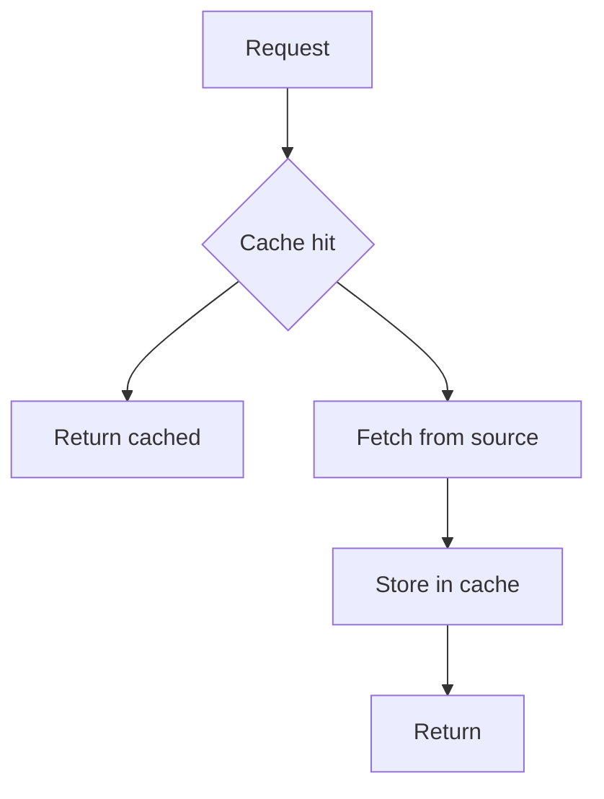

---
{"dg-publish":true,"permalink":"/software-engineering/03-data-persistence/caching/","noteIcon":"1"}
---


# Intro

Caching stores a copy of data closer to where it is used to reduce latency and load on the primary system.
You reach for it when the same data is requested frequently or when the primary data store is expensive or slow.

## Deeper Explanation

### Mental Model



Common patterns:

- Cache aside: app reads and writes the cache explicitly
- Read through and write through: cache layer does it for you
- Write behind: cache writes to source asynchronously (riskier)

### Example

Cache aside with `IDistributedCache`:

```csharp
public static async Task<string> GetUserName(
    string userId,
    IDistributedCache cache,
    Func<string, Task<string>> loadFromDb,
    CancellationToken ct)
{
    var key = $"user-name:{userId}";
    var cached = await cache.GetStringAsync(key, ct);
    if (cached is not null)
        return cached;

    var value = await loadFromDb(userId);
    await cache.SetStringAsync(
        key,
        value,
        new DistributedCacheEntryOptions { AbsoluteExpirationRelativeToNow = TimeSpan.FromMinutes(5) },
        ct);
    return value;
}
```

### Tradeoffs

- Longer TTL reduces load but increases staleness risk
- Distributed cache adds infra and consistency complexity but scales across app instances

## Questions

> [!QUESTION]- What makes caching hard?
> Invalidation and correctness.
> You need a clear staleness contract and safe fallbacks.

> [!QUESTION]- How do you reduce cache stampede?
> Add jitter to expirations, use request coalescing, and consider background refresh.

## Links

- [Caching in ASP.NET Core](https://learn.microsoft.com/aspnet/core/performance/caching/overview?view=aspnetcore-8.0)
- [IDistributedCache](https://learn.microsoft.com/dotnet/api/microsoft.extensions.caching.distributed.idistributedcache)
- [Cache aside pattern](https://learn.microsoft.com/azure/architecture/patterns/cache-aside)

<!-- whats-next:start -->

---

> [!note] Whats next
> **Parent**
>  [[Software Engineering/Software Engineering\|Software Engineering]]
>
> **Topics**
> - [[Software Engineering/03 Data Persistence/NoSQL/NoSQL\|NoSQL]]
> - [[Software Engineering/03 Data Persistence/ORMs/ORMs\|ORMs]]
> - [[Software Engineering/03 Data Persistence/SQL/SQL\|SQL]]
>
> **Pages**
> - [[Software Engineering/03 Data Persistence/ACID\|ACID]]
<!-- whats-next:end -->
