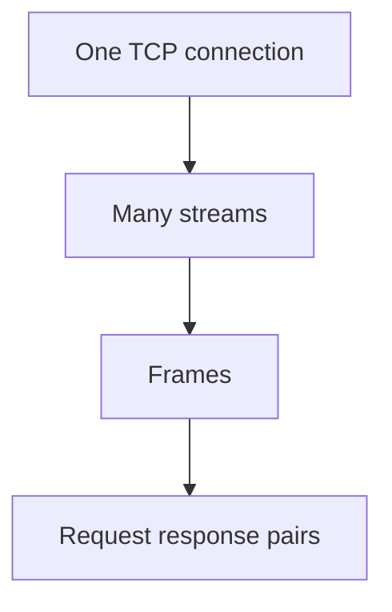

---
{"dg-publish":true,"permalink":"/software-engineering/04-networks/protocols/http-2/"}
---

# Intro

HTTP 2 is a version of HTTP that runs over a single TCP connection and multiplexes many streams at once.
You reach for it to reduce latency and improve throughput for many concurrent requests.
The mental model shift is that the unit is a stream of frames, not a single request per connection.

## Deeper Explanation

### Mental Model

## Questions

> [!QUESTION]- What problem does HTTP 2 solve compared to HTTP 1.1?
> Multiplexing and better use of one connection.
> It reduces the need for many parallel TCP connections.

> [!QUESTION]- Why can HTTP 2 still stall under packet loss?
> Because it still uses TCP.
> A lost packet blocks delivery of later packets for all streams in that connection.

## Links

- [RFC 9113 HTTP 2](https://www.rfc-editor.org/rfc/rfc9113)
- [RFC 7540 HTTP 2](https://www.rfc-editor.org/rfc/rfc7540)
- [HTTP 2](https://developer.mozilla.org/en-US/docs/Web/HTTP/Basics_of_HTTP/Evolution_of_HTTP#http2)

<!-- whats-next:start -->

---

> [!note] Whats next
> **Parent**
>  [[Software Engineering/04 Networks/04 Networks\|04 Networks]]
>
> **Pages**
> - [[Software Engineering/04 Networks/Protocols/DNS\|DNS]]
> - [[Software Engineering/04 Networks/Protocols/gRPC\|gRPC]]
> - [[Software Engineering/04 Networks/Protocols/HTTP\|HTTP]]
> - [[Software Engineering/04 Networks/Protocols/REST\|REST]]
> - [[Software Engineering/04 Networks/Protocols/RPC\|RPC]]
> - [[Software Engineering/04 Networks/Protocols/SMTP\|SMTP]]
<!-- whats-next:end -->
