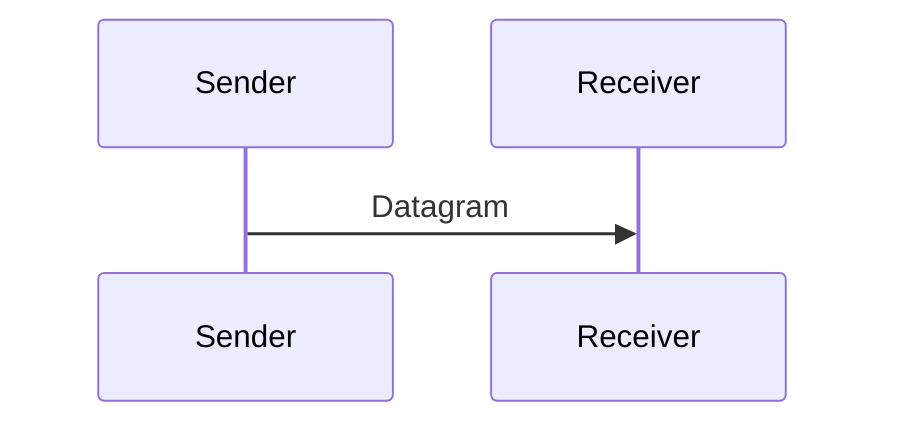

---
{"dg-publish":true,"permalink":"/software-engineering/04-networks/transport-and-sockets/udp/","noteIcon":"1"}
---


# Intro

UDP is a connectionless transport protocol that sends independent datagrams.
You reach for it for latency sensitive workloads where occasional loss is acceptable, like telemetry, voice, or game state.
The key tradeoff is speed and simplicity in exchange for reliability guarantees.

## Deeper Explanation

### Mental Model



### Example

```csharp
using var udp = new UdpClient();
var bytes = Encoding.UTF8.GetBytes("ping");
await udp.SendAsync(bytes, bytes.Length, "127.0.0.1", 9000);
```

## Questions

> [!QUESTION]- Why do some systems prefer UDP?
> Lower latency and no connection setup.
> The application can decide what to do on loss.

## Links

- [RFC 768 UDP](https://www.rfc-editor.org/rfc/rfc768)
- [UdpClient](https://learn.microsoft.com/dotnet/api/system.net.sockets.udpclient)

<!-- whats-next:start -->

---

> [!note] Whats next
> **Parent**
>  [[Software Engineering/04 Networks/04 Networks\|04 Networks]]
>
> **Pages**
> - [[Software Engineering/04 Networks/Transport & Sockets/Sockets\|Sockets]]
> - [[Software Engineering/04 Networks/Transport & Sockets/TCP IP\|TCP IP]]
<!-- whats-next:end -->
