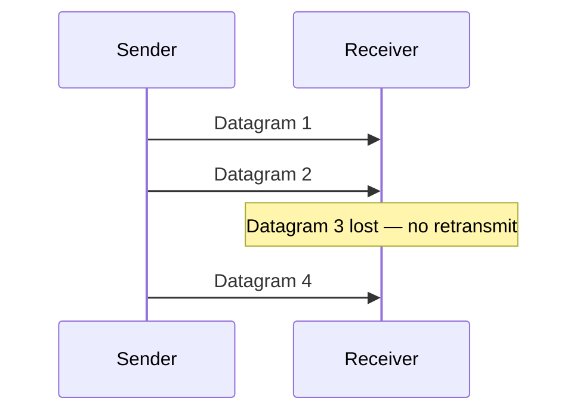

---
{"dg-publish":true,"permalink":"/software-engineering/04-networks/transport-and-sockets/udp/"}
---

# Intro

UDP (User Datagram Protocol) is a connectionless transport protocol that sends independent datagrams with no delivery guarantees. There is no handshake, no acknowledgment, no retransmission, and no ordering. You reach for it when latency matters more than reliability — real-time audio/video, gaming, DNS queries, and telemetry — where a retransmitted old packet is worse than no packet at all.

## How It Works

UDP adds a minimal 8-byte header (source port, destination port, length, checksum) to the payload and sends it. The receiver either gets it or doesn't. No state is maintained between sender and receiver.



## UDP vs TCP

| Feature | UDP | TCP |
|---------|-----|-----|
| Connection | Connectionless | Connection-oriented (3-way handshake) |
| Delivery guarantee | None | Guaranteed (retransmit on loss) |
| Ordering | None | In-order delivery |
| Flow control | None | Yes (sliding window) |
| Congestion control | None | Yes (slow start, AIMD) |
| Overhead | 8 bytes header | 20+ bytes header + state |
| Latency | Lower (no handshake, no ACK wait) | Higher |
| Use cases | Streaming, gaming, DNS, QUIC | HTTP, file transfer, databases |

## When to Use UDP

**Real-time audio/video:** a retransmitted audio packet from 200ms ago is useless — the conversation has moved on. Applications implement their own loss concealment (interpolation, FEC) rather than waiting for TCP retransmission.

**Online gaming:** game state updates (player positions, inputs) are time-sensitive. A missed update is replaced by the next one. Games implement their own reliability for critical events (hit registration) on top of UDP.

**DNS:** queries are small (fit in one datagram) and fast. If a query is lost, the client retries. The overhead of a TCP connection is not justified.

**QUIC (HTTP/3):** QUIC is built on UDP and implements its own reliable, ordered, multiplexed streams — getting TCP's reliability without TCP's head-of-line blocking.

## C# Example

```csharp
// Sender
using var udp = new UdpClient();
var bytes = Encoding.UTF8.GetBytes("ping");
await udp.SendAsync(bytes, bytes.Length, "127.0.0.1", 9000);

// Receiver
using var server = new UdpClient(9000);
var result = await server.ReceiveAsync();
var message = Encoding.UTF8.GetString(result.Buffer);
Console.WriteLine($"Received: {message} from {result.RemoteEndPoint}");
```

## Pitfalls

**No congestion control**
UDP does not back off under network congestion. A UDP sender that floods the network can starve TCP connections sharing the same link. Applications using UDP for high-throughput transfers should implement their own congestion control (as QUIC does).

**Datagram size limits**
UDP datagrams are limited to 65,507 bytes (65,535 minus headers). Larger payloads must be fragmented at the IP layer, which increases loss probability — a single lost IP fragment drops the entire datagram. Keep UDP payloads under the path MTU (~1,400 bytes for most networks) to avoid fragmentation.

**No built-in security**
UDP has no authentication or encryption. Use DTLS (Datagram TLS) for encrypted UDP, or build on QUIC which includes TLS 1.3.

## References

- [UDP specification (RFC 768)](https://www.rfc-editor.org/rfc/rfc768) — the original 3-page UDP specification; notable for its brevity.
- [UdpClient class (Microsoft Learn)](https://learn.microsoft.com/en-us/dotnet/api/system.net.sockets.udpclient) — .NET API reference for sending and receiving UDP datagrams.
- [TCP vs UDP (Cloudflare Learning)](https://www.cloudflare.com/learning/ddos/glossary/user-datagram-protocol-udp/) — accessible comparison of TCP and UDP with use case guidance.
- [QUIC and HTTP/3 (RFC 9000)](https://www.rfc-editor.org/rfc/rfc9000) — how QUIC builds reliable, multiplexed streams on top of UDP to get the best of both protocols.

<!-- whats-next:start -->

---

> [!note] Whats next
> **Parent**
>  [[Software Engineering/04 Networks/04 Networks\|04 Networks]]
>
> **Pages**
> - [[Software Engineering/04 Networks/Transport & Sockets/Sockets\|Sockets]]
> - [[Software Engineering/04 Networks/Transport & Sockets/TCP IP\|TCP IP]]
<!-- whats-next:end -->
