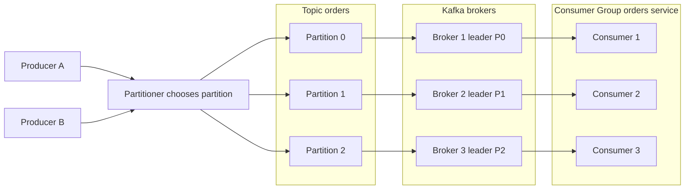

---
{"dg-publish":true,"permalink":"/software-engineering/05-architecture/distributed-systems/message-queues/kafka/","noteIcon":"3"}
---


# Intro

Apache Kafka is a distributed event streaming platform built around an append-only commit log: producers append records to topic partitions, and consumers read at their own pace using offsets.
It matters because it combines durability, high throughput, and replayability, which makes it the backbone of many event-driven architectures at scale.
You reach for Kafka when you need independent producers and consumers, long-lived event history, and horizontal scaling without losing per-key ordering.
Common use cases include event sourcing, stream processing, log aggregation, change data capture, and real-time analytics.

## Core Architecture



### Topics

- A **topic** is a logical channel, for example `orders`, `payments`, or `inventory_changes`.
- Topics decouple producers from consumers in both time and deployment.
- Consumers subscribe and process independently.

### Partitions

- A topic is split into **partitions**, and each partition is an ordered, immutable append-only log.
- Kafka guarantees ordering only inside one partition.
- Partitions are the scaling unit for storage and throughput.

### Producers

- Producers append records to topic partitions.
- A producer can provide a **partition key**.
- The producer partitioner hashes that key to pick a partition.
- Same key maps to the same partition for a stable partitioner algorithm and unchanged partition count.
- Mixed clients or custom partitioners can change mapping behavior.

### Consumer Groups

- A **consumer group** is one logical application reading a topic.
- Each partition is assigned to exactly one consumer within the group at any time.
- This gives parallel processing while preserving ordering per partition.
- If consumers exceed partition count, extras are idle.

### Offsets

- Every record in a partition has an increasing **offset**.
- Consumers track current offset per partition.
- Offsets allow replay, rewind, backfill, and fast catch-up.
- Commit timing determines whether your system behaves as at-most-once or at-least-once.

### Brokers, Leaders, and Followers

- **Brokers** are Kafka servers that store partition replicas.
- Each partition has one leader replica and zero or more follower replicas.
- Leaders serve reads and writes.
- Followers replicate from leaders and can be promoted after failures.

### ZooKeeper to KRaft

- Kafka historically depended on ZooKeeper for cluster metadata and controller coordination.
- Modern Kafka deployments migrate to **KRaft** mode where Kafka self-manages metadata via Raft.
- KRaft removes the external ZooKeeper dependency from cluster metadata management.

## Delivery Semantics

Kafka delivery guarantees come from producer acknowledgement settings, replication health, and consumer offset management.

### At-most-once

- Consumer commits offset before processing.
- Crash between commit and processing causes data loss.
- Use only when losing some events is acceptable.

### At-least-once

- Consumer processes first, then commits.
- Crash after processing and before commit causes duplicates.
- This is the most common production model.
- Consumers must be idempotent.

### Exactly-once

- Use Kafka transactions with idempotent producer in a consume-process-produce flow between Kafka topics.
- Typical requirements include `enable.idempotence=true`, a configured `transactional.id`, `acks=all`, and consumers reading transactional output with `isolation.level=read_committed`.
- Commit consumed offsets as part of the same transaction so output records and source offsets are atomic.
- Idempotent producer alone does not provide end-to-end exactly-once processing.
- This gives exactly-once processing semantics for Kafka-to-Kafka pipelines.
- External side effects like database updates or HTTP calls still require idempotency or an outbox pattern.
- Tradeoff is higher latency and complexity, so use only when business impact justifies it.

### `acks` setting

- `acks=0`: fire-and-forget, no broker acknowledgement, highest throughput and highest loss risk.
- `acks=1`: leader acknowledgement only, can lose data if leader fails before followers replicate.
- `acks=all`: waits for all in-sync replicas acknowledgement, safest choice for critical data.

## Partition Key Design

Partition key strategy determines both ordering behavior and workload balance.

- Messages with the same key go to the same partition and remain ordered.
- Wrong key design creates hot partitions and throughput bottlenecks.
- Example: a single customer ID producing most events sends most load to one partition.

Design strategies:

- Use domain key when strict local ordering is required, for example `customer_id`.
- Use composite keys like `customer_id:region` when one dimension is too skewed.
- Validate key distribution with load tests and partition-level metrics before production rollout.

## C# Example with Confluent.Kafka

```csharp
using System.Text.Json;
using System.Threading;
using Confluent.Kafka;

record Order(string OrderId, string CustomerId, decimal Amount);

var producerConfig = new ProducerConfig
{
    BootstrapServers = "localhost:9092",
    Acks = Acks.All,
    EnableIdempotence = true
};

var consumerConfig = new ConsumerConfig
{
    BootstrapServers = "localhost:9092",
    GroupId = "orders-worker",
    AutoOffsetReset = AutoOffsetReset.Earliest,
    EnableAutoCommit = false,
    EnablePartitionEof = false
};

var order = new Order("order-1001", "customer-42", 149.99m);
using var cts = new CancellationTokenSource();
var ct = cts.Token;

// Producer
using var producer = new ProducerBuilder<string, string>(producerConfig).Build();
await producer.ProduceAsync("orders", new Message<string, string>
{
    Key = order.CustomerId,
    Value = JsonSerializer.Serialize(order)
});

// Consumer
using var consumer = new ConsumerBuilder<string, string>(consumerConfig).Build();
consumer.Subscribe("orders");
try
{
    while (!ct.IsCancellationRequested)
    {
        var result = consumer.Consume(ct);
        var parsedOrder = JsonSerializer.Deserialize<Order>(result.Message.Value);
        if (parsedOrder is null)
        {
            continue;
        }
        // process...
        consumer.Commit(result);
    }
}
catch (OperationCanceledException)
{
    // graceful shutdown
}
finally
{
    consumer.Close();
}
```

## Kafka vs RabbitMQ Tradeoffs

| Dimension | Kafka | RabbitMQ |
| --- | --- | --- |
| Model | Distributed append-only log | Queue and exchange broker model |
| Ordering | Strong ordering per partition | Queue order exists but can vary with competing consumers and requeue |
| Replay | Native replay through offsets and retention | Replay is not a first-class primitive |
| Routing flexibility | Simpler partition and topic model | Rich routing patterns (direct, topic, fanout, headers) |
| Throughput | Extremely high for sequential event streams | Strong for messaging workloads but usually lower at large stream scale |
| Latency | Excellent throughput-oriented latency | Often very low for command dispatch and request-reply |
| Operational complexity | Higher partition and cluster tuning complexity | Simpler to start, complexity grows with topology and reliability features |

## Pitfalls

### Hot partitions from bad key design

- **What goes wrong:** one partition receives disproportionate load, so one consumer instance does most work.
- **Why it happens:** key hashing is deterministic and intentionally keeps equal keys together.
- **How to avoid or detect:** monitor per-partition throughput and lag, redesign keys, and use composite keys when skew is persistent.

### Consumer lag grows unnoticed

- **What goes wrong:** real-time pipeline becomes delayed and downstream SLAs fail.
- **Why it happens:** processing time per record exceeds ingest rate or partition assignment is unbalanced.
- **How to avoid or detect:** track lag alerts and inspect consumer groups regularly.

```bash
kafka-consumer-groups.sh --bootstrap-server localhost:9092 --group orders-worker --describe
```

### Too many partitions

- **What goes wrong:** increased leader election time, metadata overhead, and file handle pressure.
- **Why it happens:** each partition carries control-plane and storage overhead across brokers and clients.
- **How to avoid or detect:** size partition count from throughput targets and future growth ranges, not arbitrary large defaults.

### Ignoring `acks=all` for critical data

- **What goes wrong:** acknowledged writes can still be lost on leader failure.
- **Why it happens:** weaker ack modes return success before enough replication.
- **How to avoid or detect:** enforce `acks=all` for critical topics and combine with idempotent producer defaults.

## Interview Questions

> [!question]- You need to process order events in order per customer but handle 50K events per second. How do you design the Kafka topic?
> **Expected answer:**
> - Use `customer_id` as partition key so each customer stream stays ordered.
> - Provision enough partitions for parallelism based on measured per-partition consumer throughput and latency targets.
> - Scale consumer group instances up to partition count.
> - Monitor hot partitions and lag; if one customer dominates, consider composite key strategy.
> - Keep consumers idempotent because retries and reprocessing can still happen.
>
> **Why this question matters:** it checks whether the candidate can balance ordering guarantees and horizontal scalability.

> [!question]- Compare at-most-once, at-least-once, and exactly-once in Kafka. Which do you choose for payment events and why?
> **Expected answer:**
> - At-most-once risks loss and is rarely valid for payments.
> - At-least-once is common if handlers are idempotent and duplicates are acceptable.
> - Exactly-once requires transactions and idempotent producer flow, with added latency and complexity.
> - For payment events, choose at-least-once plus strict idempotency or exactly-once when duplicate side effects are too costly.
>
> **Why this question matters:** it tests tradeoff judgment under reliability constraints.

## References

- [Apache Kafka Documentation](https://kafka.apache.org/documentation/)
- [Confluent Kafka .NET Client Documentation](https://docs.confluent.io/kafka-clients/dotnet/current/overview.html)
- [The Log: What every software engineer should know about real-time data's unifying abstraction](https://engineering.linkedin.com/distributed-systems/log-what-every-software-engineer-should-know-about-real-time-datas-unifying)
- [The Apache Kafka Monitoring Blog Post to End Most Posts](https://www.confluent.io/blog/blog-post-on-monitoring-an-apache-kafka-deployment-to-end-most-blog-posts/)

<!-- whats-next:start -->

---

> [!note] Whats next
> **Parent**
>  [[Software Engineering/05 Architecture/Distributed Systems/Distributed Systems\|Distributed Systems]]
>
> **Pages**
> - [[Software Engineering/05 Architecture/Distributed Systems/Message Queues/MSMQ\|MSMQ]]
> - [[Software Engineering/05 Architecture/Distributed Systems/Message Queues/RabbitMQ\|RabbitMQ]]
<!-- whats-next:end -->
