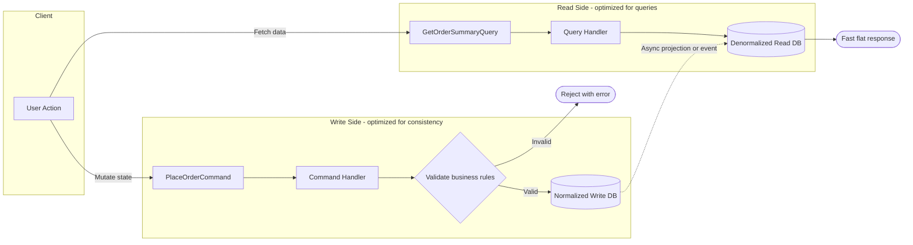

---
{"dg-publish":true,"permalink":"/software-engineering/05-architecture/patterns/cqrs/","noteIcon":""}
---

# Intro

CQRS is an architectural pattern that separates write operations (commands) from read operations (queries).

## Deeper Explanation

The key insight: the **write model** is normalized and enforces business rules, while the **read model** is denormalized and shaped for fast queries. They can use different databases, different schemas, or even different technologies. The trade-off is **eventual consistency** between the two sides.

## Questions

> [!QUESTION]- What is CQRS?
> CQRS (Command Query Responsibility Segregation) separates the model used for writes (commands that change state) from the model used for reads (queries that return data). This can simplify complex domains and enable different scaling/optimization strategies for reads vs writes. It adds complexity (more moving parts, eventual consistency when using separate read stores), so it is usually applied where the benefits justify the cost.

## Links

- [CQRS.nu - Command and Query Responsibility Segregation](https://cqrs.nu/faq/Command%20and%20Query%20Responsibility%20Segregation)

# Whats next

:LiArrowUpLeft: [[Software Engineering/05 Architecture/05 Architecture\|05 Architecture]]

<h2>Pages</h2>
<ul class="dataview list-view-ul"><li><a data-tooltip-position="top" aria-label="Software Engineering/05 Architecture/Patterns/Circut Breaker.md" data-href="Software Engineering/05 Architecture/Patterns/Circut Breaker.md" href="Software Engineering/05 Architecture/Patterns/Circut Breaker.md" class="internal-link" target="_blank" rel="noopener nofollow">Circut Breaker</a></li><li><a data-tooltip-position="top" aria-label="Software Engineering/05 Architecture/Patterns/CQS.md" data-href="Software Engineering/05 Architecture/Patterns/CQS.md" href="Software Engineering/05 Architecture/Patterns/CQS.md" class="internal-link" target="_blank" rel="noopener nofollow">CQS</a></li><li><a data-tooltip-position="top" aria-label="Software Engineering/05 Architecture/Patterns/Dependency Injection.md" data-href="Software Engineering/05 Architecture/Patterns/Dependency Injection.md" href="Software Engineering/05 Architecture/Patterns/Dependency Injection.md" class="internal-link" target="_blank" rel="noopener nofollow">Dependency Injection</a></li><li><a data-tooltip-position="top" aria-label="Software Engineering/05 Architecture/Patterns/Design Patterns.md" data-href="Software Engineering/05 Architecture/Patterns/Design Patterns.md" href="Software Engineering/05 Architecture/Patterns/Design Patterns.md" class="internal-link" target="_blank" rel="noopener nofollow">Design Patterns</a></li><li><a data-tooltip-position="top" aria-label="Software Engineering/05 Architecture/Patterns/Domain-Driven Development.md" data-href="Software Engineering/05 Architecture/Patterns/Domain-Driven Development.md" href="Software Engineering/05 Architecture/Patterns/Domain-Driven Development.md" class="internal-link" target="_blank" rel="noopener nofollow">Domain-Driven Development</a></li><li><a data-tooltip-position="top" aria-label="Software Engineering/05 Architecture/Patterns/Event Sourcing.md" data-href="Software Engineering/05 Architecture/Patterns/Event Sourcing.md" href="Software Engineering/05 Architecture/Patterns/Event Sourcing.md" class="internal-link" target="_blank" rel="noopener nofollow">Event Sourcing</a></li><li><a data-tooltip-position="top" aria-label="Software Engineering/05 Architecture/Patterns/Event-Driven Architecture.md" data-href="Software Engineering/05 Architecture/Patterns/Event-Driven Architecture.md" href="Software Engineering/05 Architecture/Patterns/Event-Driven Architecture.md" class="internal-link" target="_blank" rel="noopener nofollow">Event-Driven Architecture</a></li><li><a data-tooltip-position="top" aria-label="Software Engineering/05 Architecture/Patterns/GRASP.md" data-href="Software Engineering/05 Architecture/Patterns/GRASP.md" href="Software Engineering/05 Architecture/Patterns/GRASP.md" class="internal-link" target="_blank" rel="noopener nofollow">GRASP</a></li><li><a data-tooltip-position="top" aria-label="Software Engineering/05 Architecture/Patterns/Repository &amp; UoW.md" data-href="Software Engineering/05 Architecture/Patterns/Repository &amp; UoW.md" href="Software Engineering/05 Architecture/Patterns/Repository &amp; UoW.md" class="internal-link" target="_blank" rel="noopener nofollow">Repository &amp; UoW</a></li></ul>

