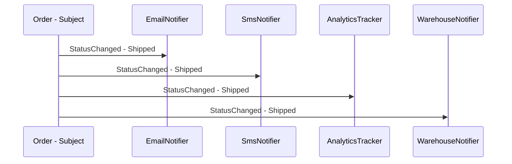

---
{"dg-publish":true,"permalink":"/software-engineering/05-architecture/patterns/design-patterns/behavioral/observer/"}
---

# Observer

A newspaper subscription is the Observer pattern in everyday life. You subscribe once, and the publisher delivers every new issue to your mailbox automatically. You didn’t ask for each specific issue — you registered your interest, and the publisher notifies all subscribers whenever there’s something new. Unsubscribe anytime, and the deliveries stop. The publisher doesn’t need to know what you do with the newspaper.

The Observer pattern defines a one-to-many dependency: when one object (the **subject** or **publisher**) changes state, all its dependents (**observers** or **subscribers**) are notified automatically. The subject maintains a subscriber list and calls each observer when state changes. Observers register and unregister independently — the subject doesn’t know how many observers exist or what they do. In C#, **`event` and `delegate` ARE the Observer pattern** — the language has it built in. `order.StatusChanged += handler` is subscribe; `order.StatusChanged -= handler` is unsubscribe; raising the event is notify.



## Problem

`OrderService.UpdateStatus()` directly calls every subscriber — adding a new subscriber means editing the service:

```csharp
public class OrderService
{
    private readonly IEmailService _email;
    private readonly ISmsService _sms;
    private readonly IAnalyticsService _analytics;
    private readonly IWarehouseService _warehouse;

    // ⚠️ OrderService knows every subscriber — tight coupling
    public async Task UpdateStatusAsync(Guid orderId, OrderStatus newStatus)
    {
        var order = await _repository.GetAsync(orderId);
        order.Status = newStatus;
        await _repository.UpdateAsync(order);

        // ⚠️ Adding a new subscriber (push notification, ERP system) requires editing this method
        await _email.SendStatusUpdateAsync(order.Customer.Email, order.Id, newStatus);
        await _sms.SendStatusUpdateAsync(order.Customer.Phone, order.Id, newStatus);
        await _analytics.TrackStatusChangeAsync(order.Id, newStatus);
        await _warehouse.NotifyStatusChangeAsync(order.Id, newStatus);
    }
}
```

Here's what breaks when requirements change: adding a push notification subscriber requires editing `OrderService` — a class that should only know about order state, not notification channels.

## Solution

Two approaches: C# `event` (language-native) and explicit subscriber list (more control):

```csharp
// Approach 1: C# event — the idiomatic .NET Observer
public class Order
{
    public Guid Id { get; set; }
    public OrderStatus Status { get; private set; }
    public Customer Customer { get; set; } = null!;

    // ✅ event IS the Observer pattern — subscribers register independently
    public event EventHandler<OrderStatusChangedEventArgs>? StatusChanged;

    public void UpdateStatus(OrderStatus newStatus)
    {
        var previous = Status;
        Status = newStatus;
        // ✅ Raise event — Order doesn't know who's listening
        StatusChanged?.Invoke(this, new OrderStatusChangedEventArgs(Id, previous, newStatus));
    }
}

public record OrderStatusChangedEventArgs(Guid OrderId, OrderStatus Previous, OrderStatus New)
    : EventArgs;

// Subscribers register independently — OrderService doesn't know about them
public class EmailNotifier(IEmailService email)
{
    public void Subscribe(Order order) =>
        order.StatusChanged += async (_, e) =>
            await email.SendStatusUpdateAsync(order.Customer.Email, e.OrderId, e.New);
}

public class AnalyticsTracker(IAnalyticsService analytics)
{
    public void Subscribe(Order order) =>
        order.StatusChanged += async (_, e) =>
            await analytics.TrackStatusChangeAsync(e.OrderId, e.New);
}

// ✅ Adding push notifications = new subscriber class, zero changes to Order or OrderService
public class PushNotifier(IPushService push)
{
    public void Subscribe(Order order) =>
        order.StatusChanged += async (_, e) =>
            await push.SendAsync(order.Customer.DeviceToken, $"Order {e.OrderId}: {e.New}");
}

// Approach 2: Explicit subscriber list — more control over async execution
public interface IOrderStatusObserver
{
    Task OnStatusChangedAsync(Order order, OrderStatus previous, OrderStatus current);
}

public class Order
{
    private readonly List<IOrderStatusObserver> _observers = [];

    public void Subscribe(IOrderStatusObserver observer) => _observers.Add(observer);
    public void Unsubscribe(IOrderStatusObserver observer) => _observers.Remove(observer);

    public async Task UpdateStatusAsync(OrderStatus newStatus)
    {
        var previous = Status;
        Status = newStatus;
        // ✅ Notify all observers — Order doesn't know their types
        // Run in parallel for independent notifications
        await Task.WhenAll(_observers.Select(o => o.OnStatusChangedAsync(this, previous, newStatus)));
    }
}

// DI registration for explicit observer approach
builder.Services.AddScoped<IOrderStatusObserver, EmailNotifier>();
builder.Services.AddScoped<IOrderStatusObserver, SmsNotifier>();
builder.Services.AddScoped<IOrderStatusObserver, AnalyticsTracker>();
// ✅ Adding push notifications = register new observer, zero code changes
builder.Services.AddScoped<IOrderStatusObserver, PushNotifier>();
```

Adding a push notification subscriber now means a new class registered in DI — `Order` and `OrderService` never change.

## You Already Use This

**C# `event` / `delegate`** — the language-native Observer. Every `event` in .NET is an Observer pattern implementation. `button.Click += handler` subscribes; `button.Click -= handler` unsubscribes. The event publisher doesn't know the subscribers.

**`IObservable<T>` / `IObserver<T>`** — the Reactive Extensions (Rx) Observer interfaces. `IObservable<T>` is the subject; `IObserver<T>` is the observer. Rx adds operators (filter, transform, combine) over the observable stream.

**`INotifyPropertyChanged`** — WPF/MAUI data binding uses Observer. `PropertyChanged` event notifies the UI when a property changes. The ViewModel raises the event; the binding infrastructure subscribes.

**`ObservableCollection<T>`** — raises `CollectionChanged` events when items are added, removed, or replaced. WPF/MAUI list controls subscribe to update the UI automatically.

**`IChangeToken` / `ChangeToken.OnChange()`** — ASP.NET Core's Observer for configuration changes. `IConfiguration.GetReloadToken()` returns a token that fires when configuration is reloaded.

## Pitfalls

**Memory leaks from unsubscribed event handlers** — if a short-lived subscriber subscribes to a long-lived publisher's event and never unsubscribes, the publisher holds a reference to the subscriber, preventing garbage collection. Classic example: a view subscribes to a ViewModel's event; the view is closed but the ViewModel lives on. Always unsubscribe in `Dispose()` or use weak event patterns (`WeakEventManager`).

**Exception in one observer breaks all others** — if `EmailNotifier` throws, subsequent observers (`SmsNotifier`, `AnalyticsTracker`) never run. Wrap each observer call in try/catch, or use `Task.WhenAll` with exception aggregation. Decide upfront: should one observer's failure stop others?

**Ordering dependencies between observers** — if `WarehouseNotifier` must run before `ShippingNotifier`, you have an implicit ordering dependency. The Observer pattern doesn't guarantee order. Make the dependency explicit: use a Chain of Responsibility or a sequenced event pipeline instead.

## Tradeoffs

| Concern | C# `event` | Explicit `IOrderStatusObserver` list |
|---|---|---|
| Async support | Awkward (`async void` or fire-and-forget) | Natural (`Task`-returning interface) |
| Error handling | Exceptions propagate to publisher | Can wrap each observer independently |
| Subscriber discovery | Manual registration | DI container can inject all implementations |
| Ordering control | None | Explicit via registration order |
| Unsubscription | Must hold reference to handler delegate | Remove from list |

**Decision rule**: Use C# `event` for synchronous, UI-oriented notifications where `async void` is acceptable (WPF/MAUI event handlers). Use explicit `IObserver` interface for async, server-side notifications where error handling and ordering matter. Use `IObservable<T>` (Rx) when you need stream operators (filter, throttle, combine).

## Questions

> [!QUESTION]- Why does subscribing to an event with `async void` cause problems?
> `async void` event handlers can't be awaited. If the handler throws, the exception propagates to the synchronization context (often crashing the app) rather than being catchable by the publisher. If the handler does async work, the publisher doesn't know when it completes — the event returns before the async work finishes. Use `async void` only for top-level event handlers in UI frameworks where the framework expects it. For server-side observers, use an explicit `Task`-returning interface and `await Task.WhenAll(observers.Select(o => o.OnStatusChangedAsync(...)))`.

> [!QUESTION]- How do you prevent memory leaks from event subscriptions?
> Three approaches: (1) **Unsubscribe in `Dispose()`** — implement `IDisposable` and unsubscribe in `Dispose()`. (2) **Weak event pattern** — use `WeakEventManager` (WPF) or `WeakReference<T>` to hold subscriber references; the publisher doesn't prevent GC. (3) **Scoped lifetime** — if both publisher and subscriber have the same DI lifetime (both scoped), they're collected together. The tradeoff: explicit unsubscription is reliable but requires discipline; weak events are automatic but add complexity and slight performance overhead.

> [!QUESTION]- When should you use `IObservable<T>` (Rx) instead of plain events?
> When you need stream operators: filtering (`Where`), transformation (`Select`), throttling (`Throttle`), combining multiple streams (`Merge`, `CombineLatest`), or backpressure. Plain events are push-only with no composition. Rx adds a rich operator library over the observable stream. Use Rx when: you're processing a stream of events with complex filtering or timing requirements (e.g., "notify only if status changes twice within 5 seconds"). The cost: Rx has a steep learning curve and adds a dependency. For simple one-to-many notification, plain events or explicit interfaces are sufficient.

## References

- [Observer — refactoring.guru](https://refactoring.guru/design-patterns/observer) — canonical pattern description with subject/observer diagram and C# example
- [Events (C# programming guide) — Microsoft Learn](https://learn.microsoft.com/en-us/dotnet/csharp/programming-guide/events/) — C# event/delegate as the language-native Observer
- [IObservable<T> — Microsoft Learn](https://learn.microsoft.com/en-us/dotnet/api/system.iobservable-1) — Reactive Extensions Observer interfaces
- [Weak event patterns — Microsoft Learn](https://learn.microsoft.com/en-us/dotnet/desktop/wpf/events/weak-event-patterns) — preventing memory leaks in long-lived publishers

<!-- whats-next:start -->

---

> [!note] Whats next
> **Parent**
>  [[Software Engineering/05 Architecture/Patterns/Design Patterns/Design Patterns\|Design Patterns]]
>
> **Pages**
> - [[Software Engineering/05 Architecture/Patterns/Design Patterns/Behavioral/Chain of Responsibility\|Chain of Responsibility]]
> - [[Software Engineering/05 Architecture/Patterns/Design Patterns/Behavioral/Command\|Command]]
> - [[Software Engineering/05 Architecture/Patterns/Design Patterns/Behavioral/Interpreter\|Interpreter]]
> - [[Software Engineering/05 Architecture/Patterns/Design Patterns/Behavioral/Iterator\|Iterator]]
> - [[Software Engineering/05 Architecture/Patterns/Design Patterns/Behavioral/Mediator\|Mediator]]
> - [[Software Engineering/05 Architecture/Patterns/Design Patterns/Behavioral/Memento\|Memento]]
> - [[Software Engineering/05 Architecture/Patterns/Design Patterns/Behavioral/State\|State]]
> - [[Software Engineering/05 Architecture/Patterns/Design Patterns/Behavioral/Strategy\|Strategy]]
> - [[Software Engineering/05 Architecture/Patterns/Design Patterns/Behavioral/Template Method\|Template Method]]
> - [[Software Engineering/05 Architecture/Patterns/Design Patterns/Behavioral/Visitor\|Visitor]]
<!-- whats-next:end -->
