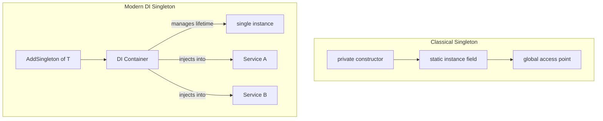

---
{"dg-publish":true,"permalink":"/software-engineering/05-architecture/patterns/design-patterns/creational/singleton/"}
---

# Singleton

A country has exactly one president at a time. Everyone refers to "the president" — there’s a single instance that serves the entire nation. You don’t create a new president when you need one; you access the existing one through a well-known entry point. If two departments tried to independently elect their own president, you’d have chaos.

The Singleton pattern ensures a class has only one instance and provides a global access point to it. In modern .NET, **`services.AddSingleton<T>()`** is the correct implementation — it’s testable, injectable, and lifetime-controlled by the DI container. The classical form (static instance, private constructor, double-checked locking) is largely obsolete in DI-based applications: it creates hidden global state, makes testing difficult, and introduces captive dependency bugs when a singleton captures a scoped service. Understand the classical form to recognize it in legacy code; use DI-managed singletons for all new work.



## Problem

Multiple `AppConfig` instances read the same config file independently, wasting resources and risking inconsistent state:

```csharp
// Classical Singleton — the pattern most tutorials show
public class AppConfig
{
    private static AppConfig? _instance;
    private static readonly object _lock = new();

    // ⚠️ Private constructor prevents DI container from creating instances
    private AppConfig()
    {
        ConnectionString = Environment.GetEnvironmentVariable("DB_CONNECTION")!;
        MaxOrdersPerHour = int.Parse(Environment.GetEnvironmentVariable("MAX_ORDERS") ?? "100");
    }

    // ⚠️ Double-checked locking — easy to get wrong, unnecessary with Lazy<T>
    public static AppConfig Instance
    {
        get
        {
            if (_instance is null)
            {
                lock (_lock)
                {
                    _instance ??= new AppConfig();
                }
            }
            return _instance;
        }
    }

    public string ConnectionString { get; }
    public int MaxOrdersPerHour { get; }
}

public class OrderService
{
    public async Task PlaceOrderAsync(Order order)
    {
        // ⚠️ Hidden dependency — not visible in constructor, can't be mocked in tests
        var config = AppConfig.Instance;
        if (await GetOrderCountLastHourAsync(order.Customer.Id) >= config.MaxOrdersPerHour)
            throw new RateLimitException("Order rate limit exceeded");
        // ...
    }
}
```

Here's what breaks when requirements change: unit testing `OrderService` requires the real `AppConfig` (which reads environment variables), making tests environment-dependent. You can't inject a test double.

## Solution

Use DI-managed singleton — the container controls the lifetime, and the dependency is explicit:

```csharp
// ✅ Plain class — no static members, no private constructor
public class AppConfig
{
    public string ConnectionString { get; init; }
    public int MaxOrdersPerHour { get; init; }

    public AppConfig(IConfiguration configuration)
    {
        ConnectionString = configuration.GetConnectionString("Default")
            ?? throw new InvalidOperationException("DB connection string not configured");
        MaxOrdersPerHour = configuration.GetValue<int>("RateLimiting:MaxOrdersPerHour", 100);
    }
}

// ✅ Register as singleton in DI — one instance for the application lifetime
builder.Services.AddSingleton<AppConfig>();
// Or with an interface for better testability:
builder.Services.AddSingleton<IAppConfig, AppConfig>();

// ✅ OrderService declares its dependency explicitly
public class OrderService(IAppConfig config, IOrderRepository repository)
{
    public async Task PlaceOrderAsync(Order order)
    {
        // ✅ config is injected — can be mocked in tests
        if (await repository.GetOrderCountLastHourAsync(order.Customer.Id) >= config.MaxOrdersPerHour)
            throw new RateLimitException("Order rate limit exceeded");
        await repository.SaveAsync(order);
    }
}

// ✅ Test: inject a mock config with controlled values
[Fact]
public async Task PlaceOrder_ExceedsRateLimit_Throws()
{
    var config = Substitute.For<IAppConfig>();
    config.MaxOrdersPerHour.Returns(5);
    var repository = Substitute.For<IOrderRepository>();
    repository.GetOrderCountLastHourAsync(Arg.Any<Guid>()).Returns(5);

    var service = new OrderService(config, repository);
    await Assert.ThrowsAsync<RateLimitException>(() =>
        service.PlaceOrderAsync(new Order { Customer = new Customer { Id = Guid.NewGuid() } }));
}

// When you genuinely need lazy initialization (e.g., expensive resource):
public class ExpensiveConnectionPool
{
    // ✅ Lazy<T> is thread-safe by default, no manual locking needed
    private static readonly Lazy<ExpensiveConnectionPool> _instance =
        new(() => new ExpensiveConnectionPool());

    public static ExpensiveConnectionPool Instance => _instance.Value;
    private ExpensiveConnectionPool() { /* expensive initialization */ }
}
```

## You Already Use This

**`services.AddSingleton<T>()`** — the DI container creates one instance per application lifetime and injects it wherever the type is requested. This is the recommended Singleton in modern .NET: testable, injectable, and lifetime-managed.

**`Lazy<T>`** — thread-safe lazy initialization without manual locking. `new Lazy<T>(() => new T())` creates the instance on first access. Use when initialization is expensive and the instance may not always be needed.

**`IHttpClientFactory`** — manages `HttpMessageHandler` instances as singletons (pooled), while `HttpClient` instances are transient. This solves the classic `HttpClient` socket exhaustion problem — the handler pool is the singleton.

**`IMemoryCache`** — registered as a singleton by `services.AddMemoryCache()`. One cache instance shared across all requests in the application.

**`IConfiguration`** — the configuration root is a singleton. All `IOptions<T>` instances derive from it.

## Pitfalls

**Captive dependency** — the most common production failure. A singleton that depends on a scoped service (e.g., `DbContext`) captures the scoped instance for the application's lifetime, causing stale data, connection leaks, and concurrency bugs. The DI container throws `InvalidOperationException` at startup if you try to inject a scoped service into a singleton — but only if you use `ValidateScopes = true` (enabled by default in development, not always in production). Always validate scopes in all environments.

**Hidden global state in classical Singleton** — `AppConfig.Instance` is a hidden dependency. It doesn't appear in the constructor, so callers can't see what the class needs. This makes the class hard to test and hard to reason about. Every classical Singleton is a candidate for refactoring to DI-managed singleton.

**Thread safety in classical form** — double-checked locking is subtle and easy to get wrong. `Lazy<T>` with `LazyThreadSafetyMode.ExecutionAndPublication` (the default) is the correct thread-safe lazy initialization pattern. Don't write double-checked locking manually.

## Questions

> [!QUESTION]- Why is the classical Singleton considered an anti-pattern in DI-based applications?
> Three reasons: (1) **Hidden dependency** — `AppConfig.Instance` doesn't appear in the constructor, so the dependency is invisible to callers and can't be mocked. (2) **Testability** — tests can't inject a different implementation; they're forced to use the real singleton, making tests environment-dependent. (3) **Lifetime control** — the class controls its own lifetime, bypassing the DI container's lifetime management. The DI-managed singleton solves all three: the dependency is explicit, injectable, and mockable. The tradeoff: DI-managed singletons require a DI container; classical singletons work without one (useful in library code or console apps without a host).

> [!QUESTION]- What is a captive dependency and how do you detect it?
> A captive dependency occurs when a longer-lived service holds a reference to a shorter-lived service. Example: a singleton `OrderService` injected with a scoped `DbContext` — the `DbContext` is captured for the application's lifetime, not the request's lifetime. This causes stale EF Core change tracking, connection pool exhaustion, and concurrency bugs across requests. Detection: enable `ValidateScopes = true` in `AddSingleton` options (default in development). The container throws at startup if a singleton depends on a scoped service. In production, also enable `ValidateOnBuild = true`. The fix: inject `IServiceScopeFactory` and create a scope per operation, or redesign the dependency to be singleton-safe.

> [!QUESTION]- When is the classical Singleton still appropriate?
> In library code without a DI container, or when you need a truly global, immutable resource that must be accessible without injection (e.g., a logging sink initialized before the DI container starts). `Lazy<T>` is the correct implementation in these cases. Also appropriate for value objects that are expensive to construct and inherently stateless (e.g., a compiled `Regex` pattern). The signal: if the singleton holds mutable state or has dependencies, use DI. If it's an immutable, stateless resource, classical form is acceptable.

## References

- [Singleton Pattern — Christopher Okhravi](https://www.youtube.com/watch?v=hUE_j6q0LTQ&list=PLrhzvIcii6GNjpARdnO4ueTUAVR9eMBpc&index=6) — video walkthrough of the Singleton pattern with OOP examples
- [Singleton — refactoring.guru](https://refactoring.guru/design-patterns/singleton) — canonical pattern description with thread-safety discussion and C# examples
- [Dependency injection in .NET — Microsoft Learn](https://learn.microsoft.com/en-us/dotnet/core/extensions/dependency-injection) — `AddSingleton<T>()` and service lifetime management
- [Dependency injection guidelines — Microsoft Learn](https://learn.microsoft.com/en-us/dotnet/core/extensions/dependency-injection-guidelines) — captive dependency detection and `ValidateScopes`
- [Lazy<T> — Microsoft Learn](https://learn.microsoft.com/en-us/dotnet/api/system.lazy-1) — thread-safe lazy initialization without manual locking

<!-- whats-next:start -->

---

> [!note] Whats next
> **Parent**
>  [[Software Engineering/05 Architecture/Patterns/Design Patterns/Design Patterns\|Design Patterns]]
>
> **Pages**
> - [[Software Engineering/05 Architecture/Patterns/Design Patterns/Creational/Abstract Factory\|Abstract Factory]]
> - [[Software Engineering/05 Architecture/Patterns/Design Patterns/Creational/Builder\|Builder]]
> - [[Software Engineering/05 Architecture/Patterns/Design Patterns/Creational/Factory Method\|Factory Method]]
> - [[Software Engineering/05 Architecture/Patterns/Design Patterns/Creational/Prototype\|Prototype]]
<!-- whats-next:end -->
