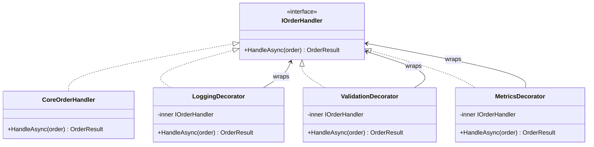

---
{"dg-publish":true,"permalink":"/software-engineering/05-architecture/patterns/design-patterns/structural/decorator/"}
---

# Decorator

Stacking toppings on a pizza is a Decorator in everyday life. Start with plain dough, add sauce, add cheese, add pepperoni, add mushrooms. Each topping wraps the previous pizza without changing what’s underneath, and you can add or remove any topping independently. A pepperoni pizza and a mushroom pizza share the same base — the toppings are layered on, not baked in.

The Decorator pattern works the same way: it attaches additional responsibilities to an object dynamically by wrapping it in decorator objects that implement the same interface. Each decorator holds a reference to the wrapped object, calls it, and adds behavior before or after the call. Decorators compose freely — you can stack `LoggingHandler(ValidationHandler(MetricsHandler(CoreHandler)))` in any order. Each decorator is independently testable and deployable. The client sees a single `IOrderHandler` and doesn’t know (or care) how many decorators are wrapping the core.



> [!NOTE] Decorator vs Proxy
> Both wrap the same interface. **Decorator ADDS new behavior** — logging, caching, validation. [[Software Engineering/05 Architecture/Patterns/Design Patterns/Structural/Proxy\|Proxy]] **CONTROLS ACCESS** to the real object — lazy loading, auth checks, remote calls. The structural difference is intent: Decorator enriches; Proxy restricts or defers.

## Problem

`OrderProcessor.ProcessOrder()` has growing cross-cutting concerns mixed with core logic:

```csharp
public class OrderProcessor
{
    private readonly IOrderRepository _repository;
    private readonly ILogger<OrderProcessor> _logger;
    private readonly IMetricsCollector _metrics;

    public async Task<OrderResult> ProcessOrderAsync(Order order)
    {
        // ⚠️ Logging, metrics, validation, and core logic all interleaved
        _logger.LogInformation("Processing order {OrderId}", order.Id);
        var stopwatch = Stopwatch.StartNew();

        try
        {
            // ⚠️ Validation mixed with processing
            if (order.Items.Count == 0)
                throw new InvalidOperationException("Order has no items");
            if (order.Total <= 0)
                throw new InvalidOperationException("Order total must be positive");

            // ⚠️ Audit trail mixed with processing
            await _auditLog.RecordAsync($"Order {order.Id} processing started by {order.Customer.Id}");

            var result = await _repository.SaveAndProcessAsync(order);

            stopwatch.Stop();
            _metrics.RecordOrderProcessingTime(stopwatch.ElapsedMilliseconds);
            _logger.LogInformation("Order {OrderId} processed in {Ms}ms", order.Id, stopwatch.ElapsedMilliseconds);

            return result;
        }
        catch (Exception ex)
        {
            _logger.LogError(ex, "Order {OrderId} processing failed", order.Id);
            _metrics.RecordOrderFailure();
            throw;
        }
        // ⚠️ Adding a new concern (rate limiting, idempotency check) means editing this method
    }
}
```

Here's what breaks when requirements change: adding idempotency checking (skip duplicate orders) requires editing `ProcessOrderAsync` — touching code that already works and risking regressions in logging, metrics, and validation.

## Solution

Each concern becomes a decorator that wraps the next handler:

```csharp
// Component interface
public interface IOrderHandler
{
    Task<OrderResult> HandleAsync(Order order);
}

// Core handler — pure business logic, no cross-cutting concerns
public class CoreOrderHandler(IOrderRepository repository) : IOrderHandler
{
    public Task<OrderResult> HandleAsync(Order order) =>
        repository.SaveAndProcessAsync(order);
}

// Decorator: validation
public class ValidationOrderHandler(IOrderHandler next) : IOrderHandler
{
    public async Task<OrderResult> HandleAsync(Order order)
    {
        // ✅ Validation isolated — can be tested independently
        if (order.Items.Count == 0)
            throw new InvalidOperationException("Order has no items");
        if (order.Total <= 0)
            throw new InvalidOperationException("Order total must be positive");

        return await next.HandleAsync(order); // ✅ delegates to next in chain
    }
}

// Decorator: logging
public class LoggingOrderHandler(IOrderHandler next, ILogger<LoggingOrderHandler> logger) : IOrderHandler
{
    public async Task<OrderResult> HandleAsync(Order order)
    {
        logger.LogInformation("Processing order {OrderId} for customer {CustomerId}",
            order.Id, order.Customer.Id);
        try
        {
            var result = await next.HandleAsync(order);
            logger.LogInformation("Order {OrderId} processed successfully", order.Id);
            return result;
        }
        catch (Exception ex)
        {
            logger.LogError(ex, "Order {OrderId} processing failed", order.Id);
            throw;
        }
    }
}

// Decorator: metrics
public class MetricsOrderHandler(IOrderHandler next, IMetricsCollector metrics) : IOrderHandler
{
    public async Task<OrderResult> HandleAsync(Order order)
    {
        var sw = Stopwatch.StartNew();
        try
        {
            var result = await next.HandleAsync(order);
            metrics.RecordOrderProcessingTime(sw.ElapsedMilliseconds);
            return result;
        }
        catch
        {
            metrics.RecordOrderFailure();
            throw;
        }
    }
}

// ✅ Adding idempotency = new decorator class, zero changes to existing decorators
public class IdempotencyOrderHandler(IOrderHandler next, IIdempotencyStore store) : IOrderHandler
{
    public async Task<OrderResult> HandleAsync(Order order)
    {
        if (await store.ExistsAsync(order.Id))
            return await store.GetResultAsync(order.Id);

        var result = await next.HandleAsync(order);
        await store.StoreAsync(order.Id, result);
        return result;
    }
}

// Composition — order matters: validation runs first, then idempotency, then logging, then metrics, then core
IOrderHandler handler =
    new ValidationOrderHandler(
        new IdempotencyOrderHandler(idempotencyStore,
            new LoggingOrderHandler(
                new MetricsOrderHandler(
                    new CoreOrderHandler(repository),
                    metrics),
                logger)));

// With Scrutor (DI-based decoration):
builder.Services.AddScoped<IOrderHandler, CoreOrderHandler>();
builder.Services.Decorate<IOrderHandler, MetricsOrderHandler>();
builder.Services.Decorate<IOrderHandler, LoggingOrderHandler>();
builder.Services.Decorate<IOrderHandler, ValidationOrderHandler>(); // outermost = runs first
```

Adding idempotency checking now means one new `IdempotencyOrderHandler` class — existing decorators and the core handler never change.

## You Already Use This

**`Stream` chain** — the canonical .NET Decorator. `new GZipStream(new CryptoStream(new BufferedStream(fileStream), encryptor, CryptoStreamMode.Write), CompressionMode.Compress)` stacks three decorators. Each wraps the next, adding compression, encryption, and buffering. All implement `Stream`.

**ASP.NET Core Middleware** — each middleware is a decorator. `app.UseAuthentication()`, `app.UseAuthorization()`, `app.UseRateLimiting()` each wrap the next `RequestDelegate`. The pipeline is a decorator chain built at startup.

**`DelegatingHandler` in `HttpClient`** — each handler in the `HttpClient` pipeline is a decorator. Retry handlers, auth handlers, and logging handlers each wrap the inner handler, adding behavior to HTTP requests and responses.

**Scrutor `Decorate<T>()`** — a DI extension that registers decorators without manual wiring. `services.Decorate<IOrderHandler, LoggingOrderHandler>()` wraps the existing `IOrderHandler` registration with the logging decorator.

## Pitfalls

**Decorator ordering matters** — validation before logging means invalid orders are rejected before being logged. Logging before validation means every invalid order attempt is logged. The order is a business decision, not a technical one. Document the intended order and enforce it in the composition root.

**Debugging wrapped stacks** — stack traces through a 5-layer decorator chain are hard to read. Each decorator adds a frame. Use structured logging with a correlation ID (set in the outermost decorator) so all log entries for one request share the same ID. In development, consider a single "all-in-one" decorator that's easier to step through.

**Decorator state leaking between requests** — if a decorator holds mutable state (e.g., a counter), it must be scoped correctly. Singleton decorators with request-scoped state cause concurrency bugs. Register decorators with the same lifetime as the component they wrap.

## Tradeoffs

| Concern | Decorator chain | Monolithic method | AOP (PostSharp/Castle) |
|---|---|---|---|
| Adding a new concern | New class, zero changes | Edit existing method | New attribute/interceptor |
| Concern ordering | Explicit at composition | Implicit in method body | Framework-controlled |
| Testability | Each decorator tested independently | Must test all concerns together | Interceptors tested separately |
| Debuggability | Deep call stacks | Single method, easy to trace | Framework magic, hard to trace |
| Complexity | Many small classes | One large class | Framework dependency |

**Decision rule**: Use Decorator when you have 3+ cross-cutting concerns that need to be independently testable and composable in different orders. For 1-2 concerns, adding them directly to the class is simpler. For concerns that span many classes (not just one), AOP or middleware is more appropriate than per-class decorators.

## Questions

> [!QUESTION]- How does ASP.NET Core Middleware implement the Decorator pattern?
> Each middleware is a decorator over `RequestDelegate next`. `app.UseAuthentication()` registers a middleware that calls `next(context)` after authenticating. The pipeline is built by composing these decorators at startup: each `Use()` call wraps the current pipeline in a new decorator. The outermost middleware runs first. This is exactly the Decorator pattern: each middleware implements the same interface (`RequestDelegate`), holds a reference to the next, and adds behavior before/after. The cost: middleware ordering bugs are runtime errors, not compile-time errors.

> [!QUESTION]- When should you use Decorator vs inheritance for adding behavior?
> Decorator when: (1) you need to add behavior at runtime or compose behaviors dynamically, (2) the class is sealed or from a third-party library, (3) you need multiple independent behaviors that can be combined in different ways. Inheritance when: the new behavior is a fundamental specialization of the type, not a cross-cutting concern. The key difference: inheritance is static (decided at compile time); Decorator is dynamic (decided at composition time). Decorator also avoids the fragile base class problem — changes to the base class don't affect decorators.

> [!QUESTION]- What's the performance cost of a deep decorator chain?
> Each decorator adds one virtual dispatch and one async state machine (if async). For a 5-layer chain, that's 5 virtual calls and 5 async allocations per request. In practice, this is negligible compared to I/O (DB queries, HTTP calls). Profile before optimizing. If the chain is genuinely hot (millions of calls/second with no I/O), consider collapsing the chain into a single class for that specific path. The tradeoff: performance vs maintainability. Premature optimization of decorator chains is a common mistake.

## References

- [Decorator Pattern — Christopher Okhravi](https://www.youtube.com/watch?v=GCraGHx6gso&list=PLrhzvIcii6GNjpARdnO4ueTUAVR9eMBpc&index=3) — video walkthrough of the Decorator pattern with OOP examples
- [Decorator — refactoring.guru](https://refactoring.guru/design-patterns/decorator) — canonical pattern description with wrapper chain diagram and C# example
- [ASP.NET Core Middleware — Microsoft Learn](https://learn.microsoft.com/en-us/aspnet/core/fundamentals/middleware/) — Decorator pattern in the ASP.NET Core request pipeline
- [Scrutor — GitHub](https://github.com/khellang/Scrutor) — DI-based decorator registration for .NET without manual wiring
- [DelegatingHandler — Microsoft Learn](https://learn.microsoft.com/en-us/dotnet/api/system.net.http.delegatinghandler) — Decorator pattern in the HttpClient pipeline

<!-- whats-next:start -->

---

> [!note] Whats next
> **Parent**
>  [[Software Engineering/05 Architecture/Patterns/Design Patterns/Design Patterns\|Design Patterns]]
>
> **Pages**
> - [[Software Engineering/05 Architecture/Patterns/Design Patterns/Structural/Adapter\|Adapter]]
> - [[Software Engineering/05 Architecture/Patterns/Design Patterns/Structural/Bridge\|Bridge]]
> - [[Software Engineering/05 Architecture/Patterns/Design Patterns/Structural/Composite\|Composite]]
> - [[Software Engineering/05 Architecture/Patterns/Design Patterns/Structural/Facade\|Facade]]
> - [[Software Engineering/05 Architecture/Patterns/Design Patterns/Structural/Flyweight\|Flyweight]]
> - [[Software Engineering/05 Architecture/Patterns/Design Patterns/Structural/Proxy\|Proxy]]
<!-- whats-next:end -->
