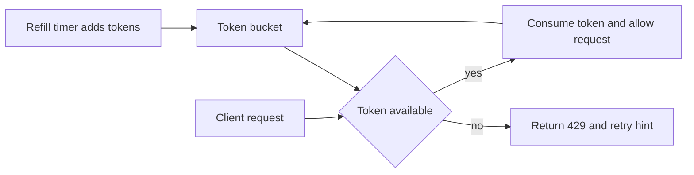

---
{"dg-publish":true,"permalink":"/software-engineering/05-architecture/patterns/resilience/rate-limiting/","tags":["FolderNote"],"noteIcon":"3"}
---

# Intro
Rate limiting controls how many requests a client can make in a period of time so one caller cannot exhaust shared resources. It matters because it protects reliability, reduces abuse, and keeps cost predictable when downstream work is expensive, especially LLM inference and embedding calls billed per request or token. In system design interviews, rate limiting is usually a quota protection mechanism, not just a security feature: it keeps latency stable for well-behaved users when traffic spikes. Reach for it on public APIs, shared multi-tenant services, and any endpoint that fans out to costly dependencies.

In .NET systems, rate limiting is often a layered decision: edge gateway limits, app-level per-tenant limits, and provider-level limits from dependencies like OpenAI or Stripe. The algorithm you choose defines failure behavior under burst traffic, memory usage, and fairness.

## Why It Matters in Senior Design Discussions
- Reliability: shields thread pools, DB connections, and downstream APIs from overload.
- Cost control: caps spend for metered dependencies such as LLM completions and vector search.
- Fairness: prevents a noisy tenant from starving others in shared infrastructure.
- Backpressure signal: explicit `429 Too Many Requests` tells clients when and how to retry.

## Core Algorithms
### Token Bucket

Token bucket maintains a bucket with capacity `B` tokens. Tokens are added at a refill rate `R` over time, and each request consumes one or more tokens. If tokens are available, the request is allowed; if not, it is rejected or queued.

Why teams like it:

- Smooth average throughput while still allowing short bursts up to bucket capacity.
- Easy to reason about for user-facing APIs where occasional bursts are expected.
- Good fit for "N requests per second with burst M" style requirements.

Tradeoffs:

- More state than fixed window (need token count plus last refill timestamp).
- Distributed implementations need atomic refill-and-consume logic per key.

When to prefer it:

- Public API with bursty clients.
- AI inference endpoints where tenants need short spikes but bounded sustained load.



### Sliding Window Log

Sliding window log stores timestamps of recent requests per key and removes entries older than the window size. A new request is allowed only if the count of timestamps in the active window is below the limit.

Why it is precise:

- Exact count for any rolling interval.
- No boundary artifacts like fixed window.

Tradeoffs:

- Highest memory and write overhead, especially for high-cardinality keys.
- Cleanup cost grows with traffic.

When to prefer it:

- Low to moderate traffic where precision is more important than memory.
- Compliance-sensitive quotas where approximation is not acceptable.

### Sliding Window Counter

Sliding window counter approximates rolling windows using two adjacent fixed buckets (current and previous), then weights the previous bucket based on elapsed time. It estimates requests in the active rolling window without storing every timestamp.

Why it is a strong default:

- Better fairness than fixed window.
- Lower memory than sliding log.

Tradeoffs:

- Approximation error near bucket boundaries.
- Slightly more implementation complexity than fixed window.

When to prefer it:

- High-throughput APIs that need near-rolling accuracy with controlled cost.
- Distributed rate limits where you want better fairness without log storage.

### Fixed Window Counter

Fixed window tracks a simple counter per key for each discrete window (for example, one minute). Counter resets when the window changes.

Why teams start with it:

- Easiest to implement and operate.
- Very low memory footprint.

Tradeoffs:

- Boundary spike: clients can send near-limit requests at the end of one window and immediately again at the start of the next.
- Effective burst can approach 2x configured rate at window edges.

When to prefer it:

- Internal services with predictable traffic.
- Early implementation where simplicity is the dominant requirement.

## Quick Comparison
| Algorithm | Burst support | Accuracy | Memory cost | Operational complexity | Typical fit |
| --- | --- | --- | --- | --- | --- |
| Fixed Window | Poor at edges | Low to medium | Low | Low | Simple internal quotas |
| Sliding Window Log | Limited by policy | High | High | Medium | Strict fairness and auditability |
| Sliding Window Counter | Medium | Medium to high | Medium | Medium | Balanced general purpose API limits |
| Token Bucket | Strong and controlled | Medium to high | Medium | Medium | Public APIs and tenant burst tolerance |

## ASP.NET Core Example
ASP.NET Core has first-class middleware support via `Microsoft.AspNetCore.RateLimiting`. You register policies in `AddRateLimiter` and attach a policy globally or per endpoint.

```csharp
using System.Threading.RateLimiting;
using Microsoft.AspNetCore.RateLimiting;

var builder = WebApplication.CreateBuilder(args);

builder.Services.AddRateLimiter(options =>
{
    options.RejectionStatusCode = StatusCodes.Status429TooManyRequests;

    options.AddFixedWindowLimiter("fixed-per-client", limiterOptions =>
    {
        limiterOptions.PermitLimit = 100;
        limiterOptions.Window = TimeSpan.FromMinutes(1);
        limiterOptions.QueueLimit = 0;
        limiterOptions.AutoReplenishment = true;
    });

    options.AddTokenBucketLimiter("token-per-client", limiterOptions =>
    {
        limiterOptions.TokenLimit = 200;
        limiterOptions.TokensPerPeriod = 20;
        limiterOptions.ReplenishmentPeriod = TimeSpan.FromSeconds(1);
        limiterOptions.QueueLimit = 0;
        limiterOptions.AutoReplenishment = true;
    });
});

var app = builder.Build();

app.UseRateLimiter();

app.MapGet("/api/public", () => Results.Ok("ok"))
   .RequireRateLimiting("token-per-client");

app.MapGet("/api/admin", () => Results.Ok("ok"))
   .RequireRateLimiting("fixed-per-client");

app.Run();
```

### Per Tenant Partitioning
For multi-tenant APIs, partition by tenant or API key, not only by IP address. ASP.NET Core supports partitioning with `PartitionedRateLimiter` so each key gets its own limiter state.

```csharp
using System.Threading.RateLimiting;

builder.Services.AddRateLimiter(options =>
{
    options.GlobalLimiter = PartitionedRateLimiter.Create<HttpContext, string>(httpContext =>
    {
        var tenantId = httpContext.User.FindFirst("tenant_id")?.Value
                       ?? httpContext.Request.Headers["X-Tenant-Id"].ToString();

        if (string.IsNullOrWhiteSpace(tenantId))
        {
            tenantId = "anonymous";
        }

        return RateLimitPartition.GetTokenBucketLimiter(
            partitionKey: tenantId,
            factory: _ => new TokenBucketRateLimiterOptions
            {
                TokenLimit = 120,
                TokensPerPeriod = 60,
                ReplenishmentPeriod = TimeSpan.FromMinutes(1),
                QueueLimit = 0,
                AutoReplenishment = true
            });
    });
});
```

Design note: partition key choice is part of domain design. For B2B SaaS, tenant key is usually correct for fairness and billing. For public anonymous APIs, IP plus user agent or a gateway-issued client ID can be more robust than raw IP alone.

## Distributed Rate Limiting
In-memory limiter state works only per process. With multiple instances behind a load balancer, each instance sees only a subset of requests, so a "100 req/min" limit can become roughly `100 x instance_count` if state is not shared.

Single-instance in-memory:

- Lowest latency and simplest operations.
- Acceptable for monoliths or when a single gateway instance enforces limits.
- Not accurate when requests are distributed across replicas.

Redis-backed distributed counters:

- Shared state across all instances for accurate global enforcement.
- Typical patterns: atomic `INCR` with expiry for fixed windows, Lua script for token bucket, sorted sets for sliding log.
- For sliding window counters, `MULTI`/`EXEC` can atomically group bucket reads and increments, but strict allow/deny decisions are safer in one Lua script (or `WATCH` plus retry) to avoid race conditions.

Operational caveat: once limiter state is remote, availability of the limiter backend becomes part of your critical path. Define a clear failure mode upfront: fail-open for availability-sensitive consumer traffic, or fail-closed for security-sensitive operations.

```text
# Simplified Redis transaction pattern for sliding window buckets
MULTI
INCR rl:tenant:{tenantId}:bucket:{currentBucket}
EXPIRE rl:tenant:{tenantId}:bucket:{currentBucket} 120
GET rl:tenant:{tenantId}:bucket:{previousBucket}
EXEC
```

## Pitfalls
### 1) Fixed window boundary spike

What goes wrong: with a limit of 100/minute, a client can send 100 requests at 12:00:59 and another 100 at 12:01:00, effectively 200 in two seconds.

Why it happens: counters reset on hard boundaries rather than rolling time.

Mitigation: prefer token bucket or sliding window counter for edge-exposed endpoints.

### 2) Wrong partition key

What goes wrong: limiting by IP can unfairly throttle many users behind one NAT, while bad actors rotate IPs to evade limits.

Why it happens: key does not reflect identity or billing unit.

Mitigation: choose key by business objective (API key, tenant, user, or composite key). Align limiter key with quota ownership.

### 3) Clock skew in distributed limiters

What goes wrong: nodes disagree on current time, leading to inconsistent window calculations and unfair accepts/rejects.

Why it happens: window math depends on timestamps from different hosts.

Mitigation: centralize time decisions in Redis scripts when possible, run NTP everywhere, and avoid client-provided timestamps.

### 4) Missing response metadata

What goes wrong: clients receive `429` without actionable retry guidance, causing aggressive blind retries and more load.

Why it happens: only status code is returned, no quota context.

Mitigation: include `Retry-After` and useful quota headers such as `X-RateLimit-Remaining`, `X-RateLimit-Limit`, and `X-RateLimit-Reset`.

## Interview Questions
> [!question] Your AI service wraps OpenAI APIs with per-tenant limits and runs on 4 instances. How do you enforce limits accurately, and which algorithm do you choose?
> **Expected answer**
> - Use distributed shared state, usually Redis, because per-instance memory breaks global accuracy.
> - Partition by tenant ID so quotas align with billing and fairness.
> - Choose token bucket when tenants need controlled burst capacity with stable average throughput.
> - Use atomic operations (Lua or transaction pattern) for refill and consume to avoid race conditions.
> - Return `429` with `Retry-After` and remaining quota headers to support client backoff.
> **Why this question matters**
> - It tests algorithm choice plus distributed systems correctness, not just definition recall.

> [!question] When would you prefer sliding window counter over fixed window in a public API?
> **Expected answer**
> - Prefer sliding window counter when edge fairness matters and fixed window boundary bursts are unacceptable.
> - It gives near-rolling behavior with lower memory than sliding log.
> - Accept approximation error in exchange for better operational cost.
> - Keep fixed window only where simplicity dominates and traffic patterns are predictable.
> **Why this question matters**
> - It checks whether the candidate can justify tradeoffs under realistic constraints.

> [!question] What failure mode should you choose if Redis-based rate limiting is unavailable: fail-open or fail-closed?
> **Expected answer**
> - Decide by endpoint risk profile, not globally.
> - Fail-open for low-risk endpoints when availability is the top priority.
> - Fail-closed for sensitive operations where abuse or cost explosion is unacceptable.
> - Document and test the behavior with chaos drills.
> **Why this question matters**
> - It tests operational judgment and explicit risk tradeoff reasoning.

## References
- [Rate limiting in ASP.NET Core](https://learn.microsoft.com/aspnet/core/performance/rate-limit)
- [System.Threading.RateLimiting namespace](https://learn.microsoft.com/dotnet/api/system.threading.ratelimiting)
- [Redis transactions (MULTI and EXEC)](https://redis.io/docs/latest/develop/interact/transactions/)
- [Scaling your API with rate limiters (Stripe Engineering)](https://stripe.com/blog/rate-limiters)
- [Cloudflare rate limiting rules](https://developers.cloudflare.com/waf/rate-limiting-rules/)

<!-- whats-next:start -->

---

> [!note] Whats next
> **Parent**
>  [[Software Engineering/05 Architecture/Patterns/Patterns\|Patterns]]
>
> **Pages**
> - [[Software Engineering/05 Architecture/Patterns/Resilience/Circuit Breaker\|Circuit Breaker]]
<!-- whats-next:end -->
