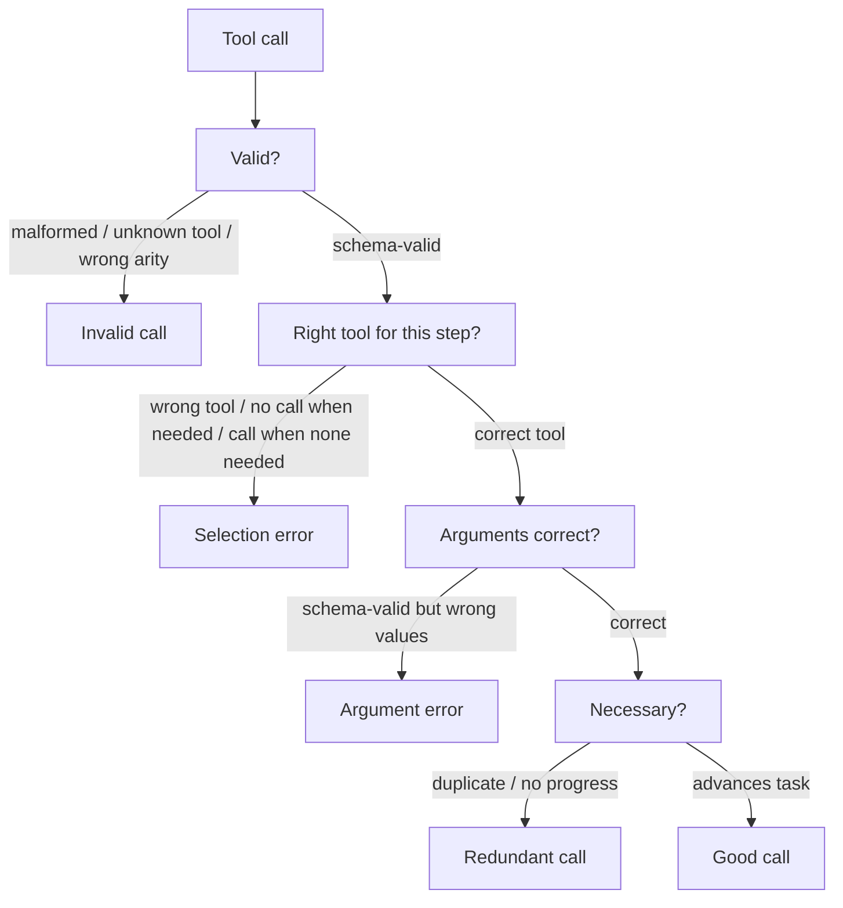

---
{"dg-publish":true,"permalink":"/software-engineering/11-ai-and-ml/llm/agents/evaluation/tool-call-evaluation/","dg-note-properties":{"topic":["AI & ML"],"subtopic":["LLM"],"level":["3"],"priority":"High","status":"Ready To Repeat"}}
---


# Intro

A tool call is the point where an agent acts on the world, and it is the most common place an agent goes wrong: it picks the wrong tool, fills an argument with a plausible-but-wrong value, invents a tool that does not exist, or calls the same thing three times. Evaluating tool calls means scoring each call along four independent axes — *was the right tool selected, were the arguments correct, was the call valid, and was it necessary* — because a single "tool accuracy" number collapses failures that have completely different fixes (a selection error is a prompt or tool-description problem; a bad-argument error is often a schema or grounding problem).

This page is the deep version of the "tool-call correctness" line in [[Software Engineering/11 AI & ML/LLM/Agents/Evaluation/Evaluation\|Agent Evaluation]]. The scoring machinery it reuses — schema validation as a [[Software Engineering/11 AI & ML/LLM/Evaluation/Deterministic Checks\|deterministic check]] and an [[Software Engineering/11 AI & ML/LLM/Evaluation/LLM-as-a-Judge\|LLM judge]] for the semantic calls — is general; only the decomposition below is agent-specific.

## What a tool call can get wrong



- **Validity** — is the call well-formed: a real tool name, the right arity, JSON that parses against the schema? Pure structure, caught for free by a deterministic schema check before the call ever executes.
- **Selection** — given the state, is this the right tool, and *should the agent have called a tool at all*? Two asymmetric errors hide here: calling a tool when none was needed (wasteful, sometimes harmful) and answering from memory when a tool was required (the agent guesses instead of looking up).
- **Arguments** — the call is schema-valid but the *values* are wrong: `order_id=4815` when the user meant `4851`, a date in the wrong timezone, a search query that drops the key constraint. This is the failure deterministic checks cannot see — the JSON is perfect, the meaning is wrong.
- **Necessity** — does the call advance the task, or is it a duplicate of one already made and a re-fetch of unchanged state? Redundant calls inflate cost and latency and are an early signal of a looping trajectory.

## Metrics

| Metric | What it measures | Scorer |
| --- | --- | --- |
| Invalid-call rate | Fraction of calls that are malformed, unknown, or schema-invalid | Deterministic |
| Tool-selection accuracy | Right tool chosen for the step (incl. correctly choosing *no* call) | Reference or judge |
| Argument match | Arguments equal the expected values — exact for ids/enums, semantic for free text | Reference (exact) + judge (semantic) |
| Redundant-call rate | Duplicate or no-progress calls per task | Deterministic (hash of tool+args) + judge |
| Calls-per-task | Total calls vs the minimum a clean solve needs | Counter |

Report selection and argument accuracy *separately*. A model can score 95% on tool selection and 70% on arguments — averaging them into one number hides that the fix is argument grounding, not tool descriptions.

## Ground truth

Two regimes, mirroring retrieval eval. **Reference-based**: each step has an expected `(tool, arguments)`, and you score selection by tool match and arguments by field-level comparison. Build these from successful human or agent trajectories rather than writing them by hand — the same chunk-anchored inversion used for [[Software Engineering/11 AI & ML/LLM/RAG/Evaluation/Retrieval Evaluation Sets\|retrieval eval sets]], applied to traces. **Reference-free**: deterministic checks cover validity and exact-duplicate detection with zero labels, and an LLM judge rates selection and necessity from the tool catalog plus the conversation. Reference-free is how you bootstrap before you have labeled traces; it cannot catch a subtly-wrong argument the way a reference can.

## Example

Per-call scoring for one step of a support agent:

```text
State: user asked "refund my order, it arrived broken" (order #4815 in context)
Agent call: issue_refund(order_id="4851", amount="full")

- Valid:      yes (schema-valid, real tool)            [deterministic: PASS]
- Selection:  issue_refund is correct here             [reference: PASS]
- Arguments:  order_id 4851 != expected 4815           [reference: FAIL]
- Necessary:  yes, advances the task                   [PASS]

Verdict: schema-valid call, wrong target order — the failure deterministic
checks cannot see. Caught only because the reference pinned order_id=4815.
```

## Tradeoffs

| Scorer | Catches | Cost | Blind to |
| --- | --- | --- | --- |
| Deterministic schema check | Malformed calls, unknown tools, exact duplicates | Lowest — runs pre-execution | Semantically wrong arguments, wrong tool choice |
| Reference match | Wrong tool, wrong argument values | Medium — needs labeled traces | Valid alternate tools/paths the reference didn't list |
| LLM judge | Tool-choice reasonableness, necessity, semantic args | Highest — a judge call per step, plus judge bias | Subtle value errors a reference would pin exactly |

Decision rule: run the deterministic validity check on every call always — it is free and pre-execution, so it can *block* a bad call rather than just score it. Add reference matching for the high-traffic tools where a wrong argument is costly (payments, deletes). Reserve the judge for selection and necessity on open-ended tasks where no single reference sequence is correct, and calibrate it against human labels because it inherits the verbosity bias that rewards more tool calls.

## Pitfalls

### Exact argument match flags semantically-equal values

Scoring free-text arguments by string equality marks `"refund the full amount"` wrong against a reference of `"full refund"`, tanking argument accuracy on calls that were actually correct. Reserve exact match for ids, enums, and booleans; score natural-language arguments with a semantic judge or normalized comparison.

### Order-sensitive scoring punishes valid reorderings

Requiring the exact reference *sequence* penalizes an agent that fetched two independent read-only facts in the other order. Score independent calls as a set; only enforce order where a real dependency exists (you cannot refund before looking up the order).

### Schema-valid hides semantically wrong

The most dangerous tool error passes every deterministic check — perfect JSON, real tool, wrong value — and executes against production. Validity gates give false confidence; pair them with reference or judge argument checks, and where the action is irreversible, add a confirmation or dry-run step.

## Questions

> [!QUESTION]- Why report tool-selection and argument accuracy separately instead of one tool-call score?
> - The two failures have different root causes and fixes: selection errors point at tool descriptions and prompt routing, argument errors point at grounding and schema design
> - A single averaged number can look healthy while one axis is broken — 95% selection with 70% arguments averages to a misleading 82%
> - They need different scorers: selection is reference/judge, arguments are exact for structured fields and semantic for free text
> - Acting on the blended number wastes effort optimizing the half that is already fine
> - Tradeoff: per-axis scoring costs more labels and more judge calls, but without it you cannot tell which fix to ship — spend the granularity on the tools where a wrong call is expensive

> [!QUESTION]- Why are deterministic schema checks necessary but not sufficient for tool-call evaluation?
> - They catch malformed JSON, unknown tools, and wrong arity for free and pre-execution, so they can block a bad call before it runs
> - They are blind to semantics: a call with perfect schema and a wrong order id or mis-scoped query passes every check and then executes against real state
> - They cannot judge selection or necessity — whether a tool should have been called at all
> - Pair them with reference argument matching (for structured fields) and a judge (for selection/necessity), and add confirmation steps for irreversible actions
> - Tradeoff: the semantic layers cost labels and judge calls; gate them on the high-risk tools rather than running them on every read-only call

## References

- [Berkeley Function-Calling Leaderboard -- AST and executable accuracy for tool/function calls, including irrelevance detection (Gorilla, UC Berkeley)](https://gorilla.cs.berkeley.edu/blogs/8_berkeley_function_calling_leaderboard.html) — the standard methodology for scoring tool selection and arguments, and a live leaderboard of model performance.
- [Tool use (function calling) overview (Anthropic Docs)](https://platform.claude.com/docs/en/agents-and-tools/tool-use/overview) — how tool schemas, calls, and results are structured, which defines what a deterministic validity check enforces.
- [tau-bench -- tool-agent-user interaction with rule-grounded ground truth (Yao et al., Sierra, 2024)](https://arxiv.org/abs/2406.12045) — a benchmark whose tasks supply reference end states and policies, a practical source of tool-call ground truth.

<!-- whats-next:start -->

---

> [!note] Whats next
> **Parent**
>  [[Software Engineering/11 AI & ML/LLM/Agents/Agents\|Agents]]
>
> **Pages**
> - [[Software Engineering/11 AI & ML/LLM/Agents/Evaluation/Agent Benchmarks\|Agent Benchmarks]]
> - [[Software Engineering/11 AI & ML/LLM/Agents/Evaluation/Trajectory Evaluation\|Trajectory Evaluation]]
<!-- whats-next:end -->
