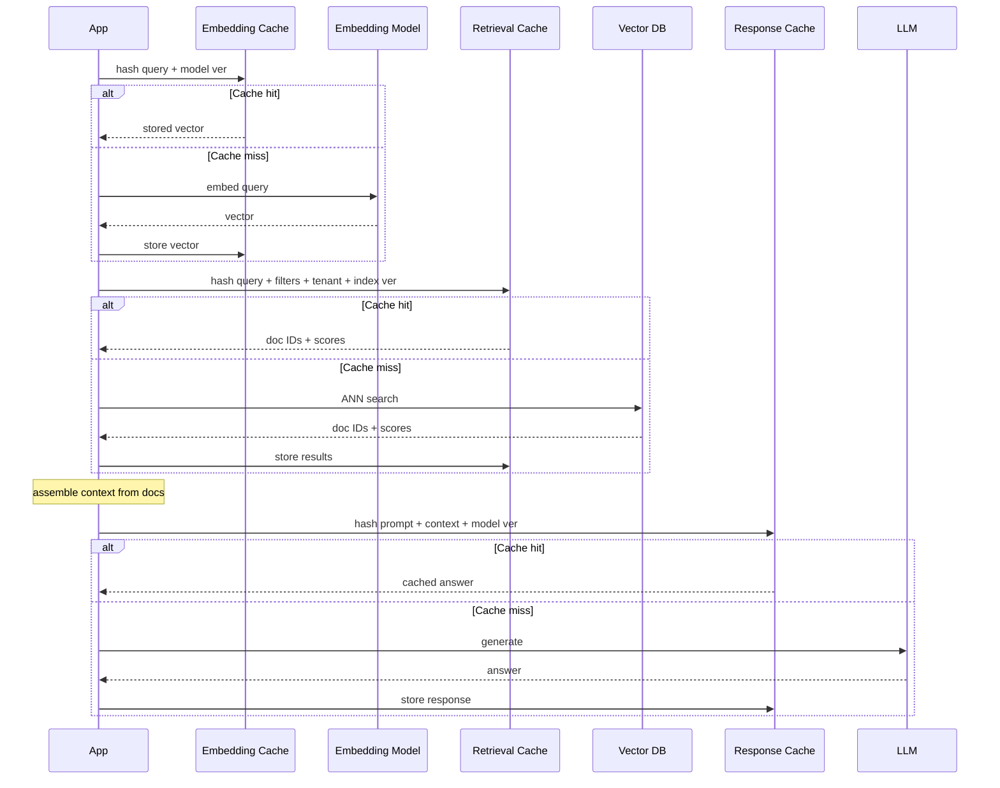

---
{"dg-publish":true,"permalink":"/software-engineering/11-ai-and-ml/llm/rag/caching/","noteIcon":"1"}
---

# Intro

A RAG pipeline repeats expensive work on every query: embedding the question, searching the index, and generating an answer from an LLM. Caching eliminates that repetition by storing results at each stage so subsequent queries can skip the computation entirely. The payoff is lower latency, lower cost, and reduced load on embedding models, vector databases, and LLMs.

The correct model is layered caching — a separate cache at each pipeline stage with its own key design, TTL policy, and invalidation trigger. A single cache at one layer does not protect you; embedding costs are wasted if you only cache responses, and response caching alone misses the opportunity to serve sub-second retrievals.

The hard part specific to RAG is that cache correctness is a security problem, not just a freshness problem. If cache keys omit authorization context, a query from an authorized user can populate the cache with evidence that a second, unauthorized user later receives. Every cache layer must include permission-scoping fields in its key.

## Embedding Cache

How it works:

- Maps text to its vector representation so the embedding model is called at most once per unique input. At ingestion time, the cache prevents re-embedding unchanged chunks when the pipeline re-runs. At query time, it prevents re-embedding identical or previously seen queries.
- The key is `hash(text) + embedding_model_version`. The value is the vector. Because the input fully determines the output (embeddings are deterministic for a given model), this is a pure function cache — if the input has not changed, the output is guaranteed correct.
- Long TTLs are safe because invalidation is structural: the cache entry becomes invalid only when the source text changes (new content hash) or the embedding model is swapped (new model version). Neither happens on a per-query basis.
Where it fits:

- High-volume ingestion pipelines where documents are re-processed frequently (nightly syncs, incremental updates). Without an embedding cache, every re-run re-embeds unchanged chunks at full cost.
- Query-heavy workloads with repeating or near-identical queries. The same customer support question phrased identically by different users hits the cache after the first embedding call.

Main risk:

- **Model version mismatch.** If the embedding model is upgraded but the cache key does not include model version, old vectors from the previous model are returned for text that was embedded before the upgrade. These vectors live in a different embedding space than the new model produces, so similarity scores become meaningless. Always include model version in the key and flush the cache on model change.

## Retrieval Cache

How it works:

- Stores the candidate document IDs and their relevance scores for a given query, so the vector search and any reranking are skipped on cache hit. The cache sits between query embedding and context assembly.
- The key must include every dimension that affects which documents are returned: the processed query text (after query translation), the embedding model version, top-k, filters, the index version, tenant ID, and an authorization context hash. Missing any one of these dimensions either leaks documents across tenants, serves stale results after index updates, or returns the wrong number of candidates.
- The value is lightweight — a list of `(document_id, score)` pairs, not full document content. This keeps cache entries small and avoids duplicating the document store.
Where it fits:

- Workloads with high query repetition and stable indexes. Customer support systems, internal knowledge bases, and documentation assistants often see the same questions repeatedly. If the index is rebuilt infrequently (daily or weekly), retrieval cache hit rates can be high.
- Systems where vector search latency or cost is the bottleneck. ANN search over large indexes (millions of vectors) can take tens of milliseconds per query; a cache hit returns in sub-milliseconds.

Main risk:

- **Stale results after index update.** If index version is not part of the cache key, documents added or removed after the last index build are invisible to cached queries. The cache silently serves outdated candidate lists. Always bump index version on every index rebuild and include it in the key.
- **Cross-tenant leakage.** If tenant ID or authorization context is missing from the key, a query from one tenant can populate the cache with results that a different tenant's query later receives. This is a data breach, not a staleness bug.

## LLM Response Cache

LLM response caching operates at two levels that solve different problems.

**Provider-level prompt caching (KV cache reuse):**

- OpenAI and Anthropic cache the key-value attention tensors computed during the prefill phase. When a new request shares a long prefix with a previous request (system prompt, few-shot examples, retrieved context), the provider skips recomputing attention for the cached prefix and starts generation from the first divergent token.
- This is automatic (OpenAI) or opt-in via `cache_control` breakpoints (Anthropic). It requires a minimum prefix length (typically 1024+ tokens) and reuses cached KV tensors for a limited window (minutes to hours depending on provider).
- The savings are significant: up to 90% input token cost reduction and 80% latency reduction on the prefill phase. But it only helps when the prefix is long, stable, and shared across requests.

**Application-level response caching (exact or semantic match):**

- The application caches the final generated answer keyed by the full input (system prompt + retrieved context + user query + model version). On an exact cache hit, the LLM is not called at all.
- Semantic caching extends this by finding cache hits for queries that are similar but not identical. The cache stores the query embedding alongside the response; on a new query, it embeds the query, searches the cache by vector similarity, and returns the cached response if the similarity score exceeds a threshold.
- Semantic caching is powerful but dangerous: a query that is semantically close but contextually different can return a wrong cached answer. Example: "What is the largest lake in Africa?" and "What is the second largest lake in Africa?" are semantically similar but have different answers. Threshold tuning is critical — too loose causes false positives, too tight reduces hit rate to near zero.
Where it fits:

- Provider-level caching benefits any system with stable, long system prompts — enable it by default, it is essentially free.
- Application-level exact caching works for FAQ-style systems with high query repetition and stable retrieval context.
- Semantic caching is viable only when false-positive risk is low and the domain is narrow enough to calibrate a reliable similarity threshold. High-stakes domains (medical, legal, financial) should avoid semantic caching or use extremely tight thresholds.

Main risk:

- **Response depends on mutable inputs.** Unlike embeddings (pure function of text + model), a response depends on the system prompt template, the retrieved evidence, the user's permissions, and the model version — all of which can change independently. A cached response becomes wrong when any of these change without invalidating the cache.
- **Semantic cache false positives.** Returning a cached answer for a semantically similar but factually different question. Mitigation: tune thresholds conservatively (0.90-0.95), include conversation context in the cache key for multi-turn systems, and monitor false-positive rate.

## Pitfalls

- **Cross-tenant leakage from missing authz fields in key.** If the retrieval or response cache key does not include tenant ID and authorization context hash, one user's cached results can be served to another user who lacks permission. This is not a performance bug — it is a data breach. Mitigation: include `tenant_id` and `authz_context_hash` in every cache key that touches document content or LLM responses. Validate tenant on cache read as a defense-in-depth check.
- **Silent staleness when index version is not part of key.** Documents are added, updated, or deleted, but the retrieval cache keeps serving old candidate lists because the key does not change. Users see outdated or missing information with no error signal. Mitigation: include `index_version` in retrieval cache keys and bump it on every index rebuild or incremental update.
- **Over-caching LLM responses while source freshness changes quickly.** If your corpus updates frequently (news, pricing, inventory) but the response cache TTL is long, users receive stale answers grounded in outdated evidence. Mitigation: tie response cache TTL to corpus update frequency. For fast-changing data, cache only embeddings and retrieval results, not final responses.
- **Semantic cache threshold miscalibration.** Too loose a threshold returns wrong cached answers for different questions. Too tight a threshold reduces hit rate to near zero, making the cache infrastructure overhead for no benefit. Mitigation: calibrate thresholds on a held-out evaluation set per domain. Monitor false-positive rate in production. Start conservative (0.92-0.95) and loosen only with evidence.

## Questions

> [!QUESTION]- Why should retrieval cache keys be based on processed query text instead of raw embeddings?
> Processed query text and transformation version are deterministic, auditable, and stable across embedding model upgrades. Raw embedding bytes are opaque, change with every model swap, and make cache invalidation on model upgrade impossible without full cache flush. Keying on processed text also aligns cache correctness with the query translation pipeline — if the translation changes, the key changes automatically.

> [!QUESTION]- Why is response caching riskier than embedding caching?
> Embedding is a pure function: same text plus same model always produces the same vector. Response generation depends on the system prompt template, the retrieved evidence (which changes with index updates), the user's permissions, and the model version — all mutable. A cached response can become wrong when any of these inputs change without cache invalidation. Embedding cache entries only go stale when the source text or model version changes, which are infrequent and structurally detectable.

> [!QUESTION]- When is semantic caching safe to deploy, and when should it be avoided?
> Semantic caching is safe when the domain is narrow, queries are repetitive, false positives have low cost, and you can calibrate a reliable similarity threshold on a held-out set. It should be avoided in high-stakes domains (medical, legal, financial) where a wrong cached answer causes harm, in multi-turn conversations where context changes the correct answer, and when the query distribution is too diverse to find a threshold that balances hit rate against false-positive rate.

## References

- [Prompt caching (OpenAI API docs)](https://developers.openai.com/docs/guides/prompt-caching)
- [Prompt caching (Anthropic docs)](https://platform.claude.com/docs/en/build-with-claude/prompt-caching)
- [SemanticCache with RedisVL](https://redis.io/docs/latest/develop/ai/redisvl/0.7.0/user_guide/llmcache/)
- [Caching embeddings (LangChain CacheBackedEmbeddings)](https://python.langchain.com/docs/how_to/caching_embeddings)
- [Semantic cache with Azure Cosmos DB](https://learn.microsoft.com/en-us/azure/cosmos-db/gen-ai/semantic-cache)
- [Reducing false positives in RAG semantic caching (InfoQ)](https://www.infoq.com/articles/reducing-false-positives-retrieval-augmented-generation/)
- [RAGOps: Operating and Managing RAG Pipelines](https://arxiv.org/abs/2506.03401)

<!-- whats-next:start -->

---

> [!note] Whats next
> **Parent**
>  [[Software Engineering/11 AI & ML/LLM/LLM\|LLM]]
>
> **Pages**
> - [[Software Engineering/11 AI & ML/LLM/RAG/Chunking\|Chunking]]
> - [[Software Engineering/11 AI & ML/LLM/RAG/Embeddings\|Embeddings]]
> - [[Software Engineering/11 AI & ML/LLM/RAG/Evaluation\|Evaluation]]
> - [[Software Engineering/11 AI & ML/LLM/RAG/Generation\|Generation]]
> - [[Software Engineering/11 AI & ML/LLM/RAG/Grounding\|Grounding]]
> - [[Software Engineering/11 AI & ML/LLM/RAG/Monitoring\|Monitoring]]
> - [[Software Engineering/11 AI & ML/LLM/RAG/Query Translation\|Query Translation]]
> - [[Software Engineering/11 AI & ML/LLM/RAG/RAG vs Fine-Tuning\|RAG vs Fine-Tuning]]
> - [[Software Engineering/11 AI & ML/LLM/RAG/Retrieval\|Retrieval]]
<!-- whats-next:end -->
