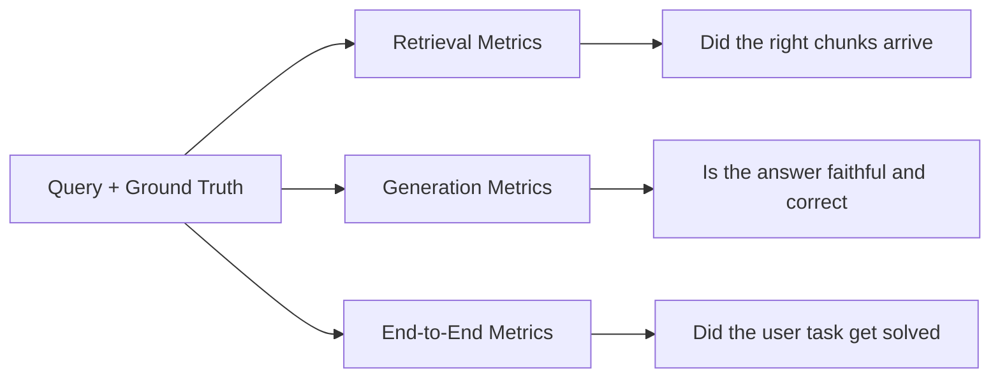
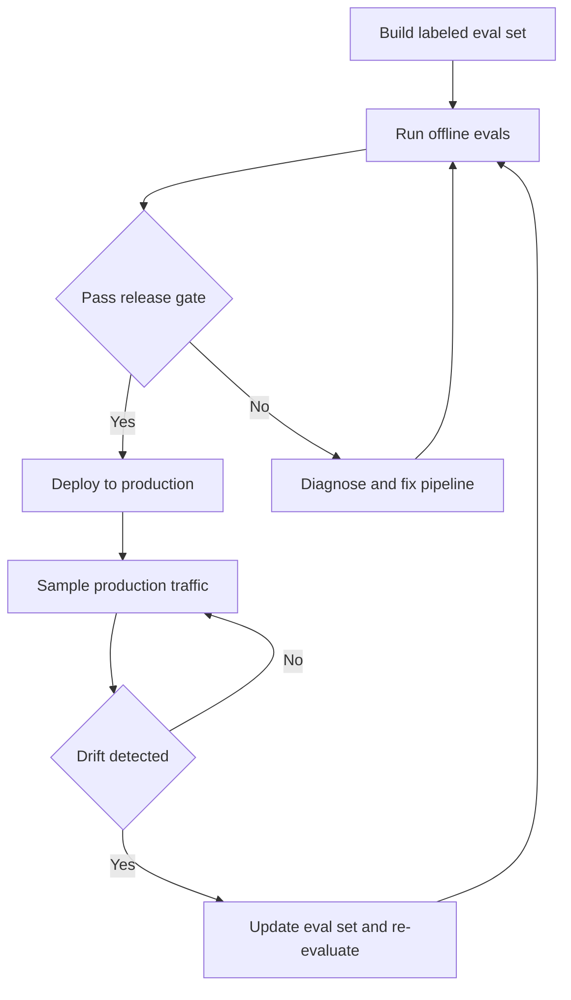

---
{"dg-publish":true,"permalink":"/software-engineering/11-ai-and-ml/llm/rag/evaluation/","dg-note-properties":{"topic":["AI & ML"],"subtopic":["LLM"],"level":["2"],"priority":"High","status":"Done"}}
---

# Intro

RAG evaluation decomposes into three layers: retrieval quality, generation quality, and end-to-end usefulness. Without this decomposition, teams observe "quality dropped" but cannot isolate whether chunking, embedding, retrieval ranking, prompt assembly, or model behavior caused the regression.

The mechanism: each layer has its own metrics, its own failure modes, and its own fix. Retrieval metrics measure whether the right evidence reaches the generator. Generation metrics measure whether the output is faithful to that evidence and actually answers the question. End-to-end metrics measure whether the user's task got solved. A pipeline can have perfect retrieval but poor generation (model ignores context), or perfect generation but poor retrieval (model faithfully summarizes irrelevant documents).

Example: a support bot returns the correct policy document (retrieval passes) but the model misreads a date constraint and answers with the wrong deadline (generation fails). Without layer separation, the team would chase retrieval improvements that cannot fix a generation problem.

## Retrieval Metrics

Retrieval metrics evaluate whether the relevant documents reached the generator. All assume a labeled set where each query has known relevant documents.

**Recall@k** — of all relevant documents in the corpus, what fraction appears in the top-k results. Recall@5 = 0.8 means 80% of relevant documents land in the top 5. This is the primary retrieval metric for RAG because the generator cannot use evidence it never sees. A recall failure is a hard ceiling on answer quality.

**Precision@k** — of the k documents retrieved, what fraction is relevant. Precision@5 = 0.6 means 3 of 5 retrieved documents are relevant. Low precision floods the context window with noise, which can degrade generation quality and increase token cost.

**MRR (Mean Reciprocal Rank)** — the average of 1/rank for the first relevant document across queries. If the first relevant result is at position 3, the reciprocal rank is 1/3. MRR rewards pushing the best result higher. Useful when the generator primarily uses the top-ranked chunk.

**nDCG@k (Normalized Discounted Cumulative Gain)** — measures ranking quality with graded relevance. Documents at higher positions contribute more to the score, and more relevant documents contribute more than partially relevant ones. nDCG captures both "did you find it" and "did you rank it well" in a single number. Range: 0 to 1.

**Empty-result rate** — the fraction of queries that return zero results. Even a small empty-result rate can indicate coverage gaps in the index (missing document types, unforeseen query patterns). Track this separately because aggregate recall hides it.

| Metric | What it answers | When to prefer |
| --- | --- | --- |
| Recall@k | Did we find the relevant documents | Primary metric -- always track |
| Precision@k | How much noise is in the context | Context window is tight or token cost matters |
| MRR | Is the best result ranked first | Generator uses only top-1 or top-2 chunks |
| nDCG@k | Is the full ranking quality good | Generator uses all k chunks with position-aware weighting |
| Empty-result rate | Are there coverage gaps | Corpus is growing or query patterns are shifting |

## Generation Metrics

Generation metrics evaluate the quality of the model's output given the retrieved context. Most are computed using an [[Software Engineering/11 AI & ML/LLM/Evaluation/LLM-as-a-Judge\|LLM-as-judge]] pattern — a separate model scores the output against the context and query.

**Faithfulness (groundedness)** — does every claim in the answer trace back to the provided context? A faithfulness evaluator decomposes the answer into individual claims, then checks each claim against the retrieved passages. Claims not supported by any passage are flagged as unfaithful. This is the RAG-specific counterpart to hallucination detection — see [[Software Engineering/11 AI & ML/LLM/Hallucinations\|Hallucinations]] for broader coverage.

**Answer correctness** — does the answer actually solve the user's question? A response can be perfectly faithful (every claim is grounded) but still wrong if it misses the key constraint, answers a different question, or is incomplete. Correctness evaluation compares the answer against a reference answer or expected behavior.

**Citation validity** — do the citations in the answer actually support the claims they are attached to? This is stricter than faithfulness: the answer may be grounded overall, but a specific citation may point to an irrelevant passage. Citation validation maps each cited passage to the claim it supposedly supports and checks the entailment.

**Response completeness** — does the answer cover all aspects of the query? A query asking "compare A and B" expects coverage of both. Partial answers score lower. Azure AI Foundry includes completeness as a separate evaluator for this reason.

## RAGAS Framework

[RAGAS](https://docs.ragas.io/) (Retrieval-Augmented Generation Assessment) implements the retrieval and generation concepts above as four named, runnable scores. Each uses [[Software Engineering/11 AI & ML/LLM/Evaluation/LLM-as-a-Judge\|LLM-as-judge]] evaluation and isolates a specific failure mode in the pipeline.

| Metric | Layer | What it measures | Reference needed |
| --- | --- | --- | --- |
| **Faithfulness** | Generation | Are all claims in the response supported by retrieved context? Score = `supported_claims / total_claims` | No |
| **Response Relevancy** | Generation | Does the response address the user's question? Reverse-engineers questions from response, measures embedding similarity to original query | No |
| **Context Precision** | Retrieval | Are relevant chunks ranked higher than irrelevant ones? Signal-to-noise in the retrieved set | Yes -- or use reference-free `ContextUtilization` variant |
| **Context Recall** | Retrieval | Did retrieval capture all evidence needed to answer? Score = `reference_claims_in_context / total_reference_claims` | Always |

Faithfulness and Response Relevancy are fully reference-free — they run without labeled ground truth. Context Recall always requires a reference answer. Context Precision has both a reference-required variant and a reference-free variant (`ContextUtilization`) that uses the generated response as a relevance proxy. Bootstrapping evaluation without a labeled set is possible with Faithfulness + Response Relevancy + ContextUtilization, but Context Recall — the retrieval ceiling metric — requires investing in a golden set.

### Diagnostic Combinations

Individual scores identify symptoms. Reading two scores together identifies root causes — this is the primary diagnostic value of the framework.

| Faithfulness | Context Recall | Diagnosis | Fix |
| --- | --- | --- | --- |
| High | Low | Retrieval ceiling — model uses what it gets correctly, but evidence is missing | Hybrid retrieval, expand k, fix metadata filters, improve embeddings |
| Low | High | Generation problem — right evidence arrives but model confabulates | Prompt constraints, grounding instructions, output validation |
| Low | Low | Systemic — retrieval broken and generation unreliable | Fix retrieval first as the upstream bottleneck, then generation |

| Context Precision | Context Recall | Diagnosis | Fix |
| --- | --- | --- | --- |
| Low | High | Noise — retrieval finds relevant docs but drowns them in irrelevant chunks | Re-ranking, tighter metadata filters, reduce k |
| High | Low | Incomplete — retrieved set is clean but missing relevant evidence | Expand k, add hybrid search, improve chunk boundaries |

### Additional RAGAS Metrics

RAGAS v0.4+ adds two metrics beyond the original four:

- **Noise Sensitivity** — measures incorrect claims introduced when retrieved context contains irrelevant chunks. Catches a gap the original four miss: the model hallucinating claims consistent with noisy context rather than ground truth. Requires reference. Lower is better.
- **Context Entities Recall** — compares named entities in the reference answer against entities in retrieved context. Useful for entity-heavy domains (legal, medical, financial) where missing a specific name, date, or identifier is a hard failure even when general topic recall is adequate.

## Component-Level Evaluation

The retrieval and generation metrics above measure end-to-end layer quality — whether the right chunks arrived and whether the answer is faithful. They do not isolate which upstream component caused the failure. A drop in Recall@5 could come from bad chunking (evidence split across boundaries), weak embeddings (model misrepresents domain vocabulary), or poor ANN approximation (index too lossy). Component-level evaluation isolates each layer so fixes target the actual bottleneck.

The methodology is ablation: change one component while holding all others constant, then measure the retrieval metric delta. If the delta is within noise, that component is not the bottleneck.

### Chunking Evaluation

There is no standalone "chunking quality" metric in most RAG frameworks. Chunking is evaluated through its downstream impact on retrieval. Two approaches exist.

**Token-level IoU** measures how efficiently retrieved chunks cover the evidence a query actually needs. Build a set of `(query, gold_evidence_span)` pairs — either manually or by prompting an LLM to generate questions from corpus chunks along with the exact text span that answers each question. For each query, compute:

- **Token Recall** = `|gold ∩ retrieved| / |gold|` — did you retrieve the relevant tokens?
- **Token Precision** = `|gold ∩ retrieved| / |retrieved|` — how much noise came along?
- **Token IoU** = `|gold ∩ retrieved| / |gold ∪ retrieved|` — combined efficiency that penalizes both missed evidence and noise

Token IoU is more informative than end-to-end Recall@k because it captures chunk efficiency. A chunking strategy can achieve high retrieval recall by retrieving large, noisy chunks while wasting context window tokens on irrelevant content. In controlled experiments, the default OpenAI configuration (800 tokens, 400 overlap) achieved 87.9% token recall but only 1.4% token precision — nearly all retrieved tokens were noise. Semantic chunking at 400 tokens reached 91.3% recall with 4.5% precision, a 3× IoU improvement.

**Ablation via retrieval metrics** is the practical alternative when building token-level ground truth is too expensive. Run the same evaluation query set through the pipeline with different chunking strategies, holding the embedding model, vector index, and retriever constant. Use a fill-to-budget retrieval policy — retrieve chunks until a token budget is filled, in rank order — rather than fixed top-k, which biases the comparison toward smaller chunks. Measure Recall@k and Faithfulness across strategies. Two patterns emerge consistently across ablation studies: chunk overlap (10-20%) shows diminishing returns when sentence-preserving splitting is already in use because the splitter already handles boundary cases, and overlap primarily inflates index size without proportional quality gains. Additionally, answer quality tends to degrade when context exceeds a few thousand tokens — the generator's attention dilutes across too much material, regardless of how well chunked it is.

### Embedding Evaluation

Embedding models are evaluated by treating retrieval quality as a proxy for embedding quality. Cosine similarity scores alone do not tell you whether an embedding model is good for your domain — you need retrieval-based metrics against a labeled evaluation set.

**Building a domain-specific evaluation set.** Collect 50-100 representative queries the system will actually receive and manually identify 3-5 relevant passages per query from the actual corpus. Store these as qrels — a mapping of `query_id → doc_id → relevance_score`. This set is essential because general benchmarks (MTEB, BEIR) do not predict domain-specific performance. Domain-specific or fine-tuned embedding models routinely outperform generalist models by 10-30% nDCG@10 on specialized corpora, even when the generalist scores higher on MTEB leaderboards.

**Model comparison protocol.** Embed the same corpus with each candidate model, retrieve against the same query set using the same ANN index configuration (to isolate the embedding variable), and compute nDCG@10 per model. Evaluate at multiple k values — some models are more top-heavy (stronger at top-3 than top-10), which matters when only 3-5 chunks are passed to the generator. If nDCG@10 difference is less than 3%, choose the cheaper or faster model. If the gap exceeds 5%, the quality gain likely justifies the cost. Domain-specific fine-tuning is worth the engineering overhead when the generic model scores below 0.75 nDCG@10 on your domain set.

**Drift monitoring.** Track three signals as a nightly heartbeat job: **JS divergence** between baseline and current embedding cluster distributions (cluster embeddings into k bins, compare histograms — set alert thresholds empirically by measuring divergence during known-good and known-bad deployments), **nearest-neighbor overlap** on a golden query set (what fraction of top-k neighbors changed between deployments — significant drops indicate the embedding space has shifted), and **behavioral signals** (CTR drop on retrieved documents, query reformulation rate spike). Gate deployments on golden Recall@k. When switching embedding models, use shadow indexes to validate before cutover — build the new index in parallel, compare golden recall and JS divergence, then ramp traffic gradually.

### Vector Search (ANN) Evaluation

ANN Recall@k measures a different quantity than the retrieval Recall@k defined above. Retrieval Recall@k asks "of all relevant documents, how many appeared in top-k?" ANN Recall@k asks "of the true k nearest neighbors found by exact brute-force search, how many did the approximate index return?" It measures the index's approximation quality in isolation — see [[Software Engineering/11 AI & ML/LLM/RAG/Retrieval\|Retrieval]] for how index parameters (HNSW `ef_search`, IVF `nprobe`) and filtered search affect retrieval mechanics.

Ground truth is established by running brute-force (exact) search over the full corpus for every query in a test set. ANN results are then compared against these true neighbors. ANN Recall@10 = 0.85 means the approximate index returned 85% of the actual 10 closest vectors.

**Tuning protocol.** Sweep `ef_search` (HNSW) or `nprobe` (IVF) across a range, plot ANN recall vs p99 latency for each value, and pick the knee of the curve — the point where recall plateaus but latency continues rising. A practical HNSW starting point is M=16-32, ef_construction=100-200, ef_search=64-128. Re-tune when the corpus grows significantly — at fixed parameters, recall degrades silently as more vectors crowd the graph because the search path explores proportionally less of it. Latency remains constant, so only explicit ANN recall checks against brute-force ground truth on a scheduled query set will detect the regression.

**Filtered search evaluation** requires separate ground truth: brute-force over only the vectors that pass the metadata filter, then compare ANN filtered results against this restricted set. Post-filtering HNSW (run ANN first, then apply filter) degrades recall significantly under high selectivity because the graph becomes disconnected when most nodes are filtered out — the severity depends on the index configuration and selectivity ratio. Test at multiple selectivity levels (100%, 10%, 1%) to characterize the degradation curve for your workload. Some vector databases offer filtered indexes that maintain graph connectivity across filter boundaries, preserving recall under narrow filters at the cost of additional index storage.

**Production monitoring.** Run ANN recall checks on a golden query set daily or after major ingestion events. Track infrastructure proxy signals: rising `nprobe` requirements to maintain recall (indicates IVF centroid collapse), shard load skew ratio exceeding 3-5× (hot shard from semantic clustering), and embedding distribution shift via KL divergence on pairwise distance distributions.

## Building an Evaluation Set

The evaluation set is the foundation — bad eval sets produce misleading metrics regardless of how sophisticated the scoring is.

### Structure

Each evaluation example contains: a query, the set of relevant documents (ground truth retrieval), and the expected answer behavior (reference answer or acceptance criteria). Some frameworks separate these: RAGAS can run reference-free (no expected answer, judges faithfulness and relevance from context alone), while ARES evaluates context relevance, answer faithfulness, and answer relevance using synthetic data plus a small human-labeled set via prediction-powered inference (PPI).

### Synthetic generation

Generate QA pairs from your corpus using an LLM: for each document chunk, prompt the model to produce questions that the chunk would answer, along with the expected answer. This bootstraps a large eval set fast. The risk is distributional homogeneity — LLM-generated questions tend to be individually reasonable but collectively similar in style and difficulty. Augment with real user queries from production logs to cover the actual query distribution.

### Golden set curation

Maintain a smaller, human-verified golden set (100-500 examples) that covers known failure modes, edge cases, and high-stakes query types. This set serves as the regression gate — if a pipeline change degrades performance on the golden set, the change is blocked regardless of aggregate metric movement. Version the golden set alongside the corpus: when the corpus changes, review which golden examples are still valid.

### Size and statistical power

Most RAG eval sets are too small to detect meaningful differences between pipeline configurations. Anthropic's analysis shows that treating eval questions as samples from a query universe and computing confidence intervals reveals that many published eval results lack statistical power. Required sample size depends on target effect size, confidence level, and metric variance. End-to-end metrics typically have higher variance than component metrics and therefore need more samples, not fewer. For regression detection: aim for enough examples that a 3-5% change in your target metric is statistically significant at your desired confidence level.

## Evaluation Loop

**Offline evaluation** runs the full pipeline against the eval set before any deployment. Compute retrieval metrics (Recall@k, nDCG@k) and generation metrics (faithfulness, correctness) on the same set. Compare against the baseline from the last release. Block deployment if any metric regresses beyond the agreed delta.

**Release gate** — define regression thresholds relative to the baseline, not absolute targets. Absolute thresholds ("Recall@5 must be above 0.85") are fragile across corpus changes. Relative thresholds ("Recall@5 must not drop more than 3% from baseline") adapt as the system improves.

**Online evaluation** samples production traffic and runs the same metrics on real queries. This catches distribution shift — queries in production that the offline eval set does not cover. For generation metrics, sample a fraction of responses and run [[Software Engineering/11 AI & ML/LLM/Evaluation/LLM-as-a-Judge\|LLM-as-judge]] scoring asynchronously. For production monitoring of these metrics, see [[Software Engineering/11 AI & ML/LLM/RAG/Monitoring\|Monitoring]].

**Regression set** — a must-pass subset of the eval set covering known past failures. Every pipeline change must pass the regression set. When a new failure is discovered in production, add the failing query to the regression set to prevent recurrence.

## Pitfalls

### Aggregate Metrics Mask Segment Regressions

A pipeline change improves average Recall@5 by 2% but degrades recall by 15% on a specific tenant's query cluster. The aggregate looks great, the tenant files a support ticket. This happens because RAG workloads are heterogeneous — different query types, document formats, and languages have different retrieval characteristics.

Detection: always slice metrics by meaningful segments — tenant, language, query cluster, document source type. If any segment degrades beyond the threshold, treat it as a regression even if the aggregate improves.

### Eval Set Drift

The corpus grows or changes, but the eval set stays frozen. Queries that were valid last month reference documents that have been updated, deleted, or superseded. The eval set reports stable metrics on stale ground truth while real users see degraded answers.

Detection: track the fraction of eval set ground-truth documents that still exist in the current index. When this drops below 90%, the eval set needs refresh. Version the eval set alongside corpus snapshots so you can tie metric changes to corpus changes, not just pipeline changes.

### LLM-as-Judge Bias in Generation Metrics

LLM judges exhibit positional bias (scoring the first response higher in pairwise comparisons), verbosity bias (rewarding longer answers regardless of correctness), and self-preference bias (scoring outputs from the same model family higher). For RAG specifically, judges are also sensitive to evaluation prompt wording — small changes in how you ask "is this answer faithful" can shift scores across the entire eval set.

Mitigation: use binary pass/fail judgments instead of numeric scales (reduces calibration noise). Run the same evaluation with varied prompt phrasings and check consistency. Validate judge outputs against a small human-labeled set and track agreement rate over time. See [[Software Engineering/11 AI & ML/LLM/Evaluation/LLM-as-a-Judge\|LLM-as-a-Judge]] for deeper coverage of judge reliability.

### Threshold Cargo-Culting

Teams copy evaluation thresholds from blog posts or conference talks ("Recall@5 should be above 0.85", "faithfulness above 0.9") without validating that those thresholds match their workload. A customer support RAG on a small curated knowledge base may need Recall@5 above 0.95 to be useful, while a research assistant over millions of papers may work acceptably at 0.7.

Fix: establish your own baseline by running the pipeline on your eval set and measuring user satisfaction at different metric levels. Set thresholds as regression deltas from your baseline, not as absolute targets borrowed from other deployments.

## Tradeoffs

| Approach | Coverage | Cost | Latency | Reliability |
| --- | --- | --- | --- | --- |
| Human evaluation | Highest -- catches nuance and edge cases | Highest -- annotator time per query | Slow -- days to weeks per batch | Gold standard but low throughput |
| LLM-as-judge | High -- handles open-ended semantics | Medium -- API cost per scored response | Fast -- seconds per judgment | Subject to bias and prompt sensitivity |
| Deterministic checks | Low -- only exact match and format rules | Lowest -- no model calls | Instant | Perfect reliability but misses semantic quality |
| Reference-free metrics | Medium -- no ground truth needed | Medium -- model calls for scoring | Fast | Lower precision -- cannot catch factual errors without reference |
| End-to-end user metrics | Highest signal -- measures real impact | Low direct cost -- piggybacks on production | Delayed -- needs traffic volume | Noisy -- confounded by UI and user behavior |

Decision rule: combine deterministic checks (format, citation presence, length) as fast gates, LLM-as-judge for semantic quality (faithfulness, correctness), and human evaluation for calibration and edge-case discovery. Use end-to-end user metrics as the ultimate validation but never as the only evaluation.

## Questions

> [!QUESTION]- Why can aggregate retrieval metrics improve while individual user segments degrade?
> - Aggregate metrics average across query types and tenants, masking localized regressions
> - A pipeline change improving average Recall@5 can simultaneously degrade recall by double digits on a specific tenant's query cluster
> - RAG workloads are heterogeneous — different query types, document formats, and languages have different retrieval characteristics
> - The fix is segment-level evaluation: slice by tenant, language, query cluster, and document source type
> - Flag any segment that degrades beyond the threshold, even when the aggregate improves
> - Tradeoff: per-segment evaluation costs more to maintain (more ground-truth labels, more compute per release) but catches the most common RAG evaluation failure in production — choose granularity based on how heterogeneous your query population is

> [!QUESTION]- Why are relative regression thresholds preferable to absolute quality targets for RAG release gates?
> - Absolute thresholds are brittle across corpus changes, model updates, and workload shifts
> - A threshold set during initial launch becomes meaningless after the corpus doubles or query distribution shifts
> - Relative thresholds (no more than N% regression from baseline) adapt automatically because the baseline tracks the current system state
> - They prevent the failure mode where a team sets an ambitious absolute target, cannot reach it, and disables the gate entirely
> - Tradeoff: relative thresholds require maintaining a consistent baseline measurement across releases, which adds CI/CD complexity — but this cost is far lower than the risk of shipping regressions that absolute thresholds cannot detect after the first corpus evolution

> [!QUESTION]- When should a team invest in building a human-annotated golden evaluation set versus relying on synthetic QA generation?
> - Synthetic generation bootstraps evaluation quickly and covers breadth at low cost
> - LLM-generated questions cluster around patterns the model finds easy to generate, missing adversarial cases, ambiguous queries, and domain-specific edge cases
> - A golden set is worth the investment when the RAG system serves high-stakes decisions (medical, legal, financial) where evaluation failures have direct business or safety impact
> - Golden sets also serve as regression gates — known past failures are captured permanently, preventing recurrence
> - In practice, combine both: synthetic for broad coverage, golden for regression gating on known failure modes
> - Tradeoff: golden sets cost annotator time (typically 2-4 hours per 100 examples) and require ongoing maintenance as the corpus evolves — invest proportionally to the cost of an undetected evaluation failure in your domain

> [!QUESTION]- Given high Faithfulness (0.91) and low Context Recall (0.54), which pipeline layer do you fix first and why?
> - High faithfulness means the model correctly uses the context it receives — generation is not the problem
> - Low context recall means retrieval misses roughly half the necessary evidence — the retrieval layer is the bottleneck
> - Retrieval quality is a hard ceiling on answer quality: the generator cannot use evidence it never sees
> - Fix retrieval first: add hybrid search (BM25 + dense), expand k, review metadata filters, check embedding domain fit
> - Do not touch prompts or generation settings until recall improves — optimizing generation against incomplete evidence is wasted effort
> - After retrieval fix, re-measure both: if faithfulness drops as recall improves, the additional context is confusing the model — add re-ranking or improve prompt grounding
> - Tradeoff: improving recall often decreases precision (more chunks = more noise) — pair recall improvements with re-ranking to maintain context quality

## References

- [RAGAS metrics reference -- faithfulness, context precision, answer correctness (RAGAS docs)](https://docs.ragas.io/en/stable/concepts/metrics/available_metrics/)
- [RAG evaluators -- groundedness, relevance, completeness (Azure AI Foundry)](https://learn.microsoft.com/en-us/azure/ai-foundry/concepts/evaluation-evaluators/rag-evaluators)
- [BEIR -- heterogeneous zero-shot retrieval benchmark across 18 datasets (NeurIPS 2021)](https://arxiv.org/abs/2104.08663)
- [RAGAS -- automated evaluation of RAG pipelines (EACL 2024)](https://arxiv.org/abs/2309.15217)
- [ARES -- automated RAG evaluation with synthetic data and prediction-powered inference (Stanford)](https://arxiv.org/abs/2311.09476)
- [A statistical approach to model evaluations -- confidence intervals and sample sizing (Anthropic)](https://www.anthropic.com/research/statistical-approach-to-model-evals)
- [Creating a LLM-as-a-judge that drives business results (Hamel Husain)](https://hamel.dev/blog/posts/llm-judge/)
- [Judging LLM-as-a-Judge with MT-Bench and Chatbot Arena -- positional and verbosity bias (NeurIPS 2023)](https://arxiv.org/abs/2306.05685)
- [Evaluating chunking strategies for retrieval -- token-level IoU methodology and benchmark (Chroma Research)](https://research.trychroma.com/evaluating-chunking)
- [A practical guide to selecting HNSW hyperparameters -- portfolio learning across 15 datasets (OpenSearch)](https://opensearch.org/blog/a-practical-guide-to-selecting-hnsw-hyperparameters/)

<!-- whats-next:start -->

---

> [!note] Whats next
> **Parent**
>  [[Software Engineering/11 AI & ML/LLM/LLM\|LLM]]
>
> **Pages**
> - [[Software Engineering/11 AI & ML/LLM/RAG/Caching\|Caching]]
> - [[Software Engineering/11 AI & ML/LLM/RAG/Chunking\|Chunking]]
> - [[Software Engineering/11 AI & ML/LLM/RAG/Monitoring\|Monitoring]]
> - [[Software Engineering/11 AI & ML/LLM/RAG/Query Translation\|Query Translation]]
> - [[Software Engineering/11 AI & ML/LLM/RAG/Re-ranking\|Re-ranking]]
> - [[Software Engineering/11 AI & ML/LLM/RAG/Retrieval\|Retrieval]]
<!-- whats-next:end -->
