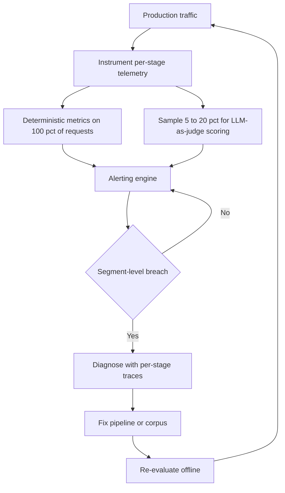

---
{"dg-publish":true,"permalink":"/software-engineering/11-ai-and-ml/llm/rag/monitoring/","noteIcon":"3"}
---

# Intro

RAG monitoring is the continuous observation of a deployed RAG pipeline to detect quality regressions, performance degradation, and data staleness before users notice. Offline [[Software Engineering/11 AI & ML/LLM/RAG/Evaluation\|Evaluation]] validates a pipeline before deployment — it answers "is this version good enough to ship?" Monitoring validates it after — it answers "is it still working as expected right now?" The distinction matters because production traffic exposes failure modes that static eval sets cannot anticipate: new query patterns, corpus drift, model behavior changes after provider updates, and load-dependent latency spikes.

The mechanism: each request flows through multiple stages — query translation, embedding, retrieval, reranking, context assembly, generation — and each stage can degrade independently. Monitoring instruments each stage with metrics and traces, samples a fraction of responses for quality scoring via [[Software Engineering/11 AI & ML/LLM/Evaluation/LLM-as-a-Judge\|LLM-as-judge]], and fires alerts when metrics breach thresholds relative to a rolling baseline. Without per-stage instrumentation, teams observe "answers got worse" but cannot tell whether retrieval stopped finding relevant documents, the reranker misordered them, or the generator hallucinated despite good context.

Example: aggregate faithfulness scores look stable at 0.91, but segmenting by tenant reveals that a financial services tenant dropped to 0.72 after a corpus update replaced their regulatory FAQ with a new document format that the chunking pipeline handles poorly. A global dashboard shows green. The tenant files a support ticket before the engineering team notices — because the alert fires on the global metric, not the segment.

## Instrumentation

How you instrument determines what you can observe. OpenTelemetry's GenAI semantic conventions (v1.40+) provide a standard attribute schema for LLM operations — `gen_ai.client.token.usage`, `gen_ai.client.operation.duration`, `gen_ai.server.time_to_first_token` — with provider-specific extensions for OpenAI, Anthropic, AWS Bedrock, and Azure AI Inference. Building on this standard avoids lock-in to a single observability vendor.

Each pipeline stage — query translation, embedding, retrieval, reranking, context assembly, generation — should emit its own span within a parent trace. The `gen_ai.operation.name` attribute distinguishes stages: `retrieval` for the retriever span, `embeddings` for embedding generation, `chat` for the LLM call. This gives you per-stage latency breakdown, error attribution, and input/output size at each boundary.

For each request, capture: the raw and translated query, retrieved document IDs with relevance scores, token counts (input and output via `gen_ai.usage.input_tokens` / `gen_ai.usage.output_tokens`), and model metadata. Logging the full prompt and response for every request is expensive at scale. A common pattern is to log full traces for a configurable sample (5–20%) and log only structured metadata (latency, token count, document IDs, scores) for 100%.

## Quality Metrics

Quality metrics split into two categories: deterministic metrics that require no model calls, and semantic metrics that require an LLM-as-judge.

### Deterministic Metrics

Compute these on every request — they are free and instant.

**Empty-result rate** — fraction of queries where retrieval returns zero documents. Even a small empty-result rate (>1%) signals coverage gaps in the index. A new query cluster that hits zero results means the corpus does not cover that topic, or the query translation step is producing embeddings in an unexpected region of the vector space.

**Retrieval count distribution** — number of documents retrieved per query. Sudden drops suggest index issues or filter misconfigurations. Sudden increases suggest that relevance thresholds were loosened or that query translation is producing overly broad rewrites.

**Citation rate** — fraction of responses that include citations when the prompt instructs the model to cite sources. A drop in citation rate signals the generator is ignoring the retrieved context — often an early indicator of prompt regression or model behavior change.

**Abstention rate** — fraction of queries where the system declines to answer. Track alongside abstention correctness: what fraction of abstentions were warranted (no relevant documents existed) vs. false abstentions (relevant documents were retrieved but the generator refused to answer).

**Response length** — median and p95 response token count. Abrupt length shifts can indicate prompt regression, model behavior change after a provider update, or context assembly bugs that produce truncated or bloated prompts.

### LLM-as-Judge Metrics

For semantic quality, run an LLM judge asynchronously on a sampled fraction of production traffic. Use binary pass/fail judgments rather than numeric scales — binary judgments reduce calibration noise and inter-judge variance, and correlate better with domain expert assessment than 1–5 scores.

**Faithfulness (groundedness)** — does every claim in the answer trace back to the retrieved context? The judge decomposes the response into atomic claims and checks each against the provided passages. Faithfulness = `supported_claims / total_claims`. This is the single most important online quality metric for RAG because it directly measures hallucination risk. For a cheaper alternative in high-volume systems, RAGAS offers FaithfulnesswithHHEM — an open-source T5-based classifier that avoids LLM API costs entirely.

**Answer relevancy** — does the response actually address the user's question? RAGAS computes this by generating N synthetic questions from the response and measuring cosine similarity between those questions and the original query. A faithfully grounded answer can still score low on relevancy if retrieval returned off-topic documents and the generator faithfully summarized them. This metric is reference-free, making it practical for online monitoring where ground-truth answers are unavailable.

**Context relevancy** — were the retrieved documents relevant to the query? This catches retrieval regressions that have not yet propagated to answer quality because the generator compensated using parametric knowledge. When context relevancy drops but faithfulness holds, the system is at elevated hallucination risk — the retrieved context is no longer providing useful evidence, and the model is filling gaps from its training data. Once parametric knowledge runs out for a query type, faithfulness will follow context relevancy downward.

**Cost control for online judging**: use a smaller, cheaper model (GPT-4o-mini, Claude Haiku) as the production judge. Reserve the expensive model for weekly calibration runs where you compare cheap-judge scores against expensive-judge scores on the same sample to track judge agreement drift.

### Performance and Cost Metrics

- **Per-stage latency** — p50, p95, p99 for each stage separately. A p95 spike in reranking is invisible in end-to-end latency if other stages are fast.
- **End-to-end latency** — total request duration. Set SLOs on p95 end-to-end, but diagnose with per-stage breakdown.
- **Token usage** — input and output tokens per request via `gen_ai.client.token.usage`. Track daily cost aggregates and per-query cost. A sudden increase suggests prompt bloat or context window misuse.
- **Cache hit rates** — per [[Software Engineering/11 AI & ML/LLM/RAG/Caching\|Caching]] layer. Drops after corpus updates are expected; sustained drops indicate a key design or invalidation problem.
- **Error rate** — rate of failed requests (model API errors, timeouts, malformed responses), segmented by stage.

### Data Health Metrics

- **Index freshness lag** — time between a document being updated in the source system and its new embedding being available in the index. Track as a distribution, not just an average — a median lag of 2 hours is fine, but a p99 lag of 3 days means some documents are silently stale.
- **Ingestion failure rate** — fraction of documents that fail during the embedding/indexing pipeline. Silent ingestion failures create invisible coverage gaps that surface as empty retrieval results for specific query types.
- **Corpus size** — total document and chunk count over time. Unexpected drops signal accidental deletions or pipeline failures.

## Segmentation

Global aggregate metrics hide localized regressions. A pipeline change that improves average faithfulness by 2% can simultaneously degrade faithfulness by 20% for a specific tenant whose documents use a different format.

Segment every metric by at least:

- **Tenant or user group** — multi-tenant systems must catch per-tenant regressions.
- **Query cluster** — group similar queries by topic, intent, or embedding proximity and track metrics per cluster.
- **Document source type** — different sources (PDFs, wikis, APIs, databases) have different chunking, formatting, and retrieval quality characteristics.
- **Language** — if the system serves multiple languages, each has its own retrieval and generation quality profile.

Segmentation is not optional. Without it, you are monitoring the average, and the average lies.

## Alerting

Effective RAG alerting uses relative thresholds anchored to a rolling baseline, not absolute values. Absolute thresholds ("faithfulness must be above 0.9") are brittle — they break across corpus changes, model updates, and seasonal query shifts. Relative thresholds ("faithfulness must not drop more than 5% from the 7-day rolling baseline") adapt automatically because the baseline tracks the current system state.

| Signal | Alert condition | Why |
| --- | --- | --- |
| Faithfulness (sampled) | Drops >5% from 7-day rolling baseline for any segment | Catches hallucination regressions before user impact |
| Empty-result rate | Exceeds 2x the historical segment average | Signals index coverage gap or filter misconfiguration |
| p95 end-to-end latency | Exceeds SLO budget for 10+ minutes | Performance regression or upstream dependency issue |
| Ingestion failure rate | Exceeds 1% of scheduled ingestions | Silent data loss accumulating |
| Token cost per query | Increases >30% from baseline | Prompt bloat, context window misuse, or upstream retrieval change |

Recompute baselines after any intentional pipeline change (model swap, prompt update, index rebuild). See the same baseline principle in [[Software Engineering/11 AI & ML/LLM/RAG/Evaluation\|Evaluation]].

## Pitfalls

### Monitoring Only Latency While Quality Degrades

A system meets latency SLOs consistently while serving increasingly ungrounded answers. This happens when a model API becomes faster but less accurate (cheaper model silently substituted by the provider), or when cache hit rates increase but cached responses are stale. Latency-only SLOs create a false sense of health.

Mitigation: always pair latency metrics with sampled quality metrics. A dashboard that says "latency is fine, faithfulness dropped 8% in the legal-docs segment" is more actionable than "all systems nominal."

### Judge Drift Without Calibration

The LLM judge used for production scoring drifts over time — either because the judge model is updated by the provider, or because the distribution of inputs changes. Faithfulness scores shift gradually but nobody notices because the absolute numbers still look reasonable.

Mitigation: maintain a small calibration set (50–100 examples) with human-labeled ground truth. Run the judge against this set weekly. Track judge-human agreement rate. If agreement drops below 80%, recalibrate the judge prompt or switch to a different judge model. This is the monitoring-side counterpart to the LLM-as-judge bias problem described in [[Software Engineering/11 AI & ML/LLM/Evaluation/LLM-as-a-Judge\|LLM-as-a-Judge]].

### Alerting on Global Aggregates Instead of Segments

The most common monitoring failure in multi-tenant RAG. Global faithfulness is 0.92. One tenant's faithfulness is 0.68. The alert never fires because the global metric is above threshold. The tenant discovers the problem before the engineering team does.

Mitigation: fire alerts at the segment level, not the global level. If segment-level alerting creates too many alerts, implement a tiered system — alert immediately on high-priority segments (large tenants, high-risk domains), batch low-priority segments into a daily digest.

### Sampling Bias in Quality Scoring

If the sampling strategy for LLM-as-judge evaluation is uniform random, it under-represents rare but important query types (multi-hop questions, negation queries, edge-case domains). These rare queries are often the ones that fail most.

Mitigation: use stratified sampling. Allocate a fixed fraction of the judge budget to each query cluster, ensuring that small clusters still get scored. Alternatively, over-sample queries where deterministic signals suggest risk — low retrieval scores, unusually high token counts, or long response latency.

## Tradeoffs

| Approach | Coverage | Cost | Latency impact | Reliability |
| --- | --- | --- | --- | --- |
| Deterministic metrics only | Low — catches format and count anomalies, not semantic quality | Lowest — no model calls | Zero — computed from existing data | Perfect — deterministic |
| Full LLM-as-judge on every request | Highest — every response scored | Highest — model API cost per request | High if synchronous, zero if async | Subject to judge drift and prompt sensitivity |
| Sampled LLM-as-judge (5–20%) | High — covers the distribution statistically | Moderate — proportional to sample rate | Zero if async | Requires careful sampling to avoid bias |
| Human review of flagged samples | Highest precision — catches judge errors | Highest in human time | Delayed — hours to days | Gold standard for calibration, low throughput |
| Embedding drift detection | Medium — catches retrieval distribution shifts | Low — statistical comparison | Zero — computed offline | Detects slow drift, not sudden failures |

Decision rule: combine deterministic metrics on 100% of traffic (fast, free), sampled LLM-as-judge on 5–20% (quality coverage), and periodic human review for calibration. Use embedding drift detection as an early warning for retrieval degradation between judge scoring cycles.

## Questions

> [!QUESTION]- Why is sampled LLM-as-judge scoring preferred over scoring every response in production?
> - Scoring every response doubles per-request cost and adds latency if synchronous.
> - At production scale (thousands of queries/hour), full scoring is prohibitively expensive.
> - Sampled scoring (5–20%) provides statistical coverage of the quality distribution at a fraction of the cost.
> - Stratified sampling ensures rare but important query types (multi-hop, negation, edge-case domains) are represented.
> - Async execution decouples scoring from user-facing latency — users never wait for the judge.
> - Full scoring is reserved for offline evaluation runs against labeled eval sets.
> - **Tradeoff**: lower sample rates reduce cost but increase the risk of missing localized regressions in small query clusters. Start at 10–20% and reduce only with evidence that the distribution is stable.

> [!QUESTION]- Why should RAG alerting use relative regression thresholds instead of absolute quality targets?
> - Absolute thresholds ("faithfulness > 0.9") are brittle across corpus changes, model updates, and query distribution shifts.
> - A threshold calibrated at launch becomes meaningless after the corpus doubles or query mix evolves.
> - Relative thresholds ("no more than 5% drop from 7-day rolling baseline") adapt automatically because the baseline tracks current system state.
> - Relative thresholds prevent the failure mode where a team sets an ambitious absolute target, cannot reach it consistently, and silently disables the alert.
> - Baselines must be recomputed after intentional pipeline changes (model swap, prompt update, index rebuild) to avoid false alarms on expected shifts.
> - **Tradeoff**: relative thresholds can miss slow, gradual degradation that stays within the rolling window. Complement with periodic absolute floor checks (e.g., monthly review of whether the baseline itself is still acceptable).

> [!QUESTION]- How does monitoring differ from evaluation in a RAG system, and why do you need both?
> - Evaluation validates a pipeline configuration against a labeled dataset before deployment — it gates releases.
> - Monitoring validates the pipeline continuously against live traffic after deployment — it catches production regressions.
> - Eval sets are static snapshots; production traffic shifts continuously with new query patterns, corpus updates, and model provider changes.
> - Monitoring catches failure modes that no static eval set anticipates: seasonal query shifts, silent model downgrades, load-dependent degradation.
> - The feedback loop connects them: failing production traces identified by monitoring get added to the eval set, preventing recurrence in future releases.
> - **Tradeoff**: monitoring alone detects problems after users are affected; evaluation alone misses production-specific failures. Neither is sufficient without the other.

## References

- [OpenTelemetry GenAI semantic conventions — metrics, spans, and events for LLM operations (OpenTelemetry)](https://opentelemetry.io/docs/specs/semconv/gen-ai/)
- [RAGAS metrics reference — faithfulness, context precision, answer relevancy formulas (RAGAS docs)](https://docs.ragas.io/en/stable/concepts/metrics/available_metrics/)
- [RAG evaluators — groundedness, relevance, completeness scoring (Azure AI Foundry)](https://learn.microsoft.com/en-us/azure/ai-foundry/concepts/evaluation-evaluators/rag-evaluators)
- [LangSmith evaluation concepts — offline vs. online evaluation architecture and production trace scoring (LangSmith docs)](https://docs.smith.langchain.com/evaluation/concepts)
- [Phoenix LLM tracing — OpenTelemetry-native observability for RAG pipelines (Arize AI)](https://docs.arize.com/phoenix/tracing/llm-traces)
- [Embedding drift detection methods — statistical approaches for retrieval distribution monitoring (Evidently AI)](https://www.evidentlyai.com/blog/embedding-drift-detection)
- [Creating a LLM-as-a-judge that drives business results — binary pass/fail, critique shadowing, and calibration (Hamel Husain)](https://hamel.dev/blog/posts/llm-judge/)
- [What we learned from a year of building with LLMs — eval strategy, monitoring, and production judge reliability (Applied LLMs)](https://applied-llms.org/)
<!-- whats-next:start -->

---

> [!note] Whats next
> **Parent**
>  [[Software Engineering/11 AI & ML/LLM/LLM\|LLM]]
>
> **Pages**
> - [[Software Engineering/11 AI & ML/LLM/RAG/Caching\|Caching]]
> - [[Software Engineering/11 AI & ML/LLM/RAG/Chunking\|Chunking]]
> - [[Software Engineering/11 AI & ML/LLM/RAG/Evaluation\|Evaluation]]
> - [[Software Engineering/11 AI & ML/LLM/RAG/Query Translation\|Query Translation]]
> - [[Software Engineering/11 AI & ML/LLM/RAG/Re-ranking\|Re-ranking]]
> - [[Software Engineering/11 AI & ML/LLM/RAG/Retrieval\|Retrieval]]
<!-- whats-next:end -->
