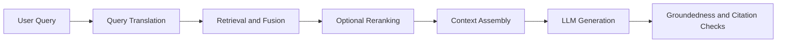

---
{"dg-publish":true,"permalink":"/software-engineering/11-ai-and-ml/llm/rag/rag/","tags":["FolderNote"],"dg-note-properties":{"topic":["AI & ML"],"subtopic":["LLM"],"tags":["FolderNote"],"status":"Done","priority":"High","level":["2"]}}
---

# Intro

Retrieval-Augmented Generation (RAG) combines retrieval and generation: retrieve evidence from your corpus, then generate an answer grounded in that evidence. It matters because knowledge changes faster than model weights, and RAG lets you update knowledge without retraining the model.
In practice, strong RAG systems are pipelines, not prompts. The main engineering work is query processing, retrieval quality, context assembly, evaluation, and production operations.
Example: for a support assistant, a user asks "What changed in API v2 rate limits?". RAG retrieves release notes and policy docs first, then the model answers with citations to the exact source sections instead of guessing from stale parametric memory.

## Core Flow

Each stage has its own page: [[Software Engineering/11 AI & ML/LLM/RAG/Query Translation\|Query Translation]] rewrites the user question into retrieval-friendly variants, [[Software Engineering/11 AI & ML/LLM/RAG/Chunking\|Chunking]] defines the unit of retrieval, [[Software Engineering/11 AI & ML/LLM/RAG/Retrieval\|Retrieval]] finds candidate evidence, [[Software Engineering/11 AI & ML/LLM/RAG/Re-ranking\|Re-ranking]] orders it, [[Software Engineering/11 AI & ML/LLM/RAG/RAG Evaluation\|RAG Evaluation]] and [[Software Engineering/11 AI & ML/LLM/RAG/Monitoring\|Monitoring]] measure it offline and in production, and [[Software Engineering/11 AI & ML/LLM/RAG/Caching\|Caching]] keeps the whole pipeline fast and affordable.

## Choosing a Pattern

Production RAG architectures range from a single retrieve-then-generate pass to agentic, graph-backed systems. The full catalog — twelve patterns with diagrams, fit criteria, risks, and a selection guide — lives in [[Software Engineering/11 AI & ML/LLM/RAG/RAG Patterns\|RAG Patterns]]. The short version, in adoption order:

- **Baseline single-pass RAG** — embed, retrieve, generate; the mandatory starting point and measurement baseline.
- **Hybrid search plus reranking** — lexical + vector retrieval with a rerank stage; the mainstream production default.
- **Query rewriting and routing** — make vague queries explicit and send each query down the cheapest capable path.
- **Parent-document retrieval** — match on small chunks, generate from their larger parent sections.
- **Multi-query fusion** — several query variants, fused rankings; raises recall on compound questions.
- **Contextual retrieval** — enrich each chunk with document-aware context at indexing time.
- **Multimodal RAG** — retrieve across text, tables, images, and scanned pages.
- **HyDE** — search with the embedding of a hypothetical answer instead of the raw query.
- **Iterative multi-hop retrieval** — retrieve, reason about gaps, retrieve again.
- **Agentic RAG** — an agent picks retrieval tools dynamically per query.
- **GraphRAG** — knowledge-graph indexing for relationship and global-synthesis questions.
- **Corrective / self-reflective RAG** — evaluator-gated retrieval and generation; research-stage for most teams.

Ship the baseline first, add hybrid search and reranking next, and adopt anything further down only for a failure mode your [[Software Engineering/11 AI & ML/LLM/RAG/RAG Evaluation\|evaluation]] actually shows.

## Operational Baselines

- Gate every pattern behind a feature flag. Measure [[Software Engineering/11 AI & ML/LLM/RAG/Monitoring#Retrieval Quality Metrics\|retrieval precision]], [[Software Engineering/11 AI & ML/LLM/RAG/Monitoring#LLM-as-Judge Metrics\|generation faithfulness]], latency p95, and cost per query before and after.
- Set hard iteration caps on looping patterns (iterative, agentic) to bound latency and cost. For corrective/self-reflective patterns, cap retry count and reject unsupported output instead of looping until the answer looks good.
- Monitor query drift and noise accumulation in iterative patterns. Track semantic similarity between the original query and each iteration's retrieval query.
- Cache aggressively: community summaries (GraphRAG), query rewrites, multi-query result sets, contextual chunk enrichments, reasoning chains, and agent tool outputs. See [[Software Engineering/11 AI & ML/LLM/RAG/Caching\|Caching]] for cache-key risks.
- Route simple queries to the cheapest path. Most production traffic is simple — do not pay multi-hop costs for single-hop questions.

## RAG vs Fine-Tuning

RAG and fine-tuning optimize different parts of the system. RAG externalizes knowledge into retrievable sources, while fine-tuning changes model behavior in weights. Choosing correctly prevents expensive retraining for problems that retrieval can solve more safely.

Example: if product policy changes weekly, RAG can update by reindexing documents. Fine-tuning would require repeated retraining cycles and still provide weak source traceability.

| Axis | RAG | Fine-tuning |
|---|---|---|
| Knowledge freshness | High | Low |
| Source traceability | High | Low |
| Behavioral consistency | Medium | High |
| Time to first value | Faster | Slower |
| Operational complexity | Retrieval and index ops | Training and eval and release ops |

**Decision rules:**

1. Start with RAG when facts change often or citation is required.
2. Add fine-tuning when output style or policy behavior remains unstable after prompt and retrieval tuning.
3. Keep mutable facts in retrieval; keep behavior patterns in fine-tuned weights.

The combined pattern — fine-tune the model for behavior (format, tone, refusal policy) and use RAG for current factual knowledge — keeps updates fast while preserving behavioral control.

## Questions

> [!QUESTION]- Why should advanced RAG patterns be introduced incrementally instead of all at once?
> Each pattern adds independent failure modes and observability needs. Incremental rollout isolates impact, allows A/B measurement against baseline, and prevents compounding complexity from masking root causes. Start with the pattern that addresses your highest-frequency failure mode.

> [!QUESTION]- When does fine-tuning beat adding more retrieval sophistication?
> When the failure is behavioral, not factual: the model retrieves the right evidence but keeps producing the wrong format, tone, or policy behavior despite prompt iteration. Retrieval upgrades cannot fix behavior encoded in weights. Conversely, fine-tuning cannot fix missing or stale knowledge — it bakes in a snapshot that starts aging immediately and provides no source traceability. Diagnose first: if faithfulness is high but style or policy compliance is low, fine-tune; if evidence is missing or wrong, improve retrieval.

## References

- [Retrieval-Augmented Generation for Knowledge-Intensive NLP Tasks](https://arxiv.org/abs/2005.11401) — the original RAG paper; useful for understanding the baseline retrieve-then-generate formulation before modern production extensions.
- [RAG techniques in Azure AI Search](https://learn.microsoft.com/en-us/azure/search/retrieval-augmented-generation-overview) — Microsoft's current production-oriented overview of classic RAG, chunking, indexing, retrieval, and answer generation.
- [Retrieval-Augmented Generation for Large Language Models: A Survey (Gao et al., 2024)](https://arxiv.org/abs/2312.10997) — comprehensive survey mapping naive, advanced, and modular RAG architectures.
- [Fine-tuning guide (OpenAI)](https://platform.openai.com/docs/guides/fine-tuning) — provider guidance on when fine-tuning is and is not the right tool, complementing the decision rules above.

<!-- whats-next:start -->

---

> [!note] Whats next
> **Parent**
>  [[Software Engineering/11 AI & ML/LLM/LLM\|LLM]]
>
> **Pages**
> - [[Software Engineering/11 AI & ML/LLM/RAG/Caching\|Caching]]
> - [[Software Engineering/11 AI & ML/LLM/RAG/Chunking\|Chunking]]
> - [[Software Engineering/11 AI & ML/LLM/RAG/Monitoring\|Monitoring]]
> - [[Software Engineering/11 AI & ML/LLM/RAG/Query Translation\|Query Translation]]
> - [[Software Engineering/11 AI & ML/LLM/RAG/RAG Evaluation\|RAG Evaluation]]
> - [[Software Engineering/11 AI & ML/LLM/RAG/RAG Patterns\|RAG Patterns]]
> - [[Software Engineering/11 AI & ML/LLM/RAG/Re-ranking\|Re-ranking]]
> - [[Software Engineering/11 AI & ML/LLM/RAG/Retrieval\|Retrieval]]
<!-- whats-next:end -->
