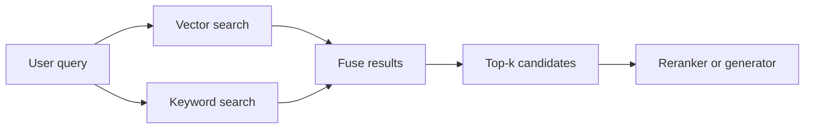

---
{"dg-publish":true,"permalink":"/software-engineering/11-ai-and-ml/llm/rag/retrieval/","noteIcon":"1"}
---

# Intro

Retrieval is the stage that decides what evidence enters the prompt. In most RAG systems, generation quality plateaus at the quality of retrieval — no prompt engineering or model upgrade compensates for missing or wrong context. The goal is to balance recall (find everything relevant), precision (exclude everything irrelevant), and latency across query types: semantic paraphrases, exact identifiers, and multi-constraint requests.

The mechanism: the user query is converted into one or more search representations — a vector (for semantic search), a set of weighted terms (for keyword search), or both. The vector is matched against pre-indexed chunk vectors in a vector database. The terms are matched via a keyword index (BM25). The top-k candidates from one or both paths are fused into a single ranked list and passed to [[Software Engineering/11 AI & ML/LLM/RAG/Re-ranking\|reranking]] or directly to the generator.

Example: a user asks "rate limit error 429 behavior in partner tier." Vector search captures the semantic intent — rate limiting behavior — but may miss the exact token `429`. Keyword search catches `429` and `partner tier` via exact word match but misses semantically related content phrased differently. Running both in parallel and fusing results covers both failure modes. Though hybrid is the safe default, it is not universally better — see Pitfalls.

## Retrieval Modes

### Dense Retrieval — Vector Search

How it works:

- An embedding model converts the query and each document chunk into fixed-size vectors in the same space. Chunk vectors are pre-computed and stored at index time; only the query vector is computed at search time. This is what makes vector search fast — you pay the embedding cost per document once, not per query.
- The vector database finds the closest chunk vectors using an approximate index (commonly HNSW or IVF). "Approximate" means it trades a small accuracy loss for massive speed gains — searching millions of vectors in milliseconds instead of scanning every one.
- Embedding model choice directly affects retrieval quality. Models differ in dimensionality, training data, and domain coverage. MTEB leaderboard scores are a starting point, but a model topping MTEB on general benchmarks can collapse on specialized corpora or non-English queries — always evaluate on your own data.

Where it fits:

- Semantic paraphrases and natural-language questions where user wording differs from source text.
- Multilingual corpora where the embedding model captures meaning across languages.

Main risk:

- **Misses exact identifiers.** Embedding models learn to capture meaning, not specific tokens. Error codes, API paths, and version strings get lost in the vector representation. The retriever returns topically related but operationally wrong chunks — and unlike keyword search misses (which return obviously unrelated content), vector search misses look plausible, making them harder to catch.

### Sparse Retrieval — Keyword Search (BM25)

If you have used full-text search in PostgreSQL (`to_tsvector`/`to_tsquery`) or Elasticsearch, BM25 is the same core idea — it is the algorithm behind those search indexes. Think of it as `grep` with ranking: it finds documents containing your exact words, then sorts them by how distinctive those words are in the corpus. A query for `NullReferenceException` in a .NET codebase hits exactly the files that contain that string, and files where it appears in a focused context (short file, rare term) rank above a 10,000-line log dump that happens to mention it once.

How it works:

- BM25 scores documents by how well their words match the query words, giving higher weight to rare terms. If a query contains `E4392` and only 3 documents in the corpus mention that code, those documents score high. Common words like "the" or "error" contribute almost nothing because they appear everywhere.
- Two behaviors that make BM25 better than naive word counting: repeating a word many times in a document does not keep increasing the score (diminishing returns), and long documents do not dominate just by having more words (length penalty).
- Runs on a standard keyword index — no embedding model, no GPU, no vector database needed. Operationally the simplest retrieval mode.

Where it fits:

- Queries with exact keyword constraints: error codes, product names, version numbers, configuration keys.
- Domains with specialized terminology where exact matches carry high signal.

Main risk:

- **Weak on paraphrases.** BM25 cannot match "authentication failure" to a chunk about "credential validation errors" because the words do not overlap. Synonym expansion and stemming help marginally but do not close the gap with vector search on semantically varied queries.

### Hybrid Retrieval — Vector + Keyword

Hybrid retrieval is like running both a full-text search (`WHERE body @@ to_tsquery('error & 429')`) and a vector similarity search against the same query, then merging the two result sets. RRF merges by rank position — like taking two independently sorted result lists and boosting any item that appears near the top of both. If document A is #2 in vector search and #5 in keyword search, while document B is #1 in keyword search but #200 in vector search, RRF ranks A higher because both retrievers agree it is relevant. Linear combination is the same idea but lets you explicitly set how much you trust each retriever — like a weighted `UNION ALL` with a tunable ratio.

How it works:

- Run vector search and keyword search in parallel against the same query. Fuse the two ranked lists into a single candidate set.
- **[[Software Engineering/11 AI & ML/LLM/RAG/Re-ranking\|Reciprocal Rank Fusion (RRF)]]** is the most common fusion method: for each document, sum `1 / (k + rank)` across retrievers, where k=60 is the standard constant. RRF only uses rank positions, not scores — so it works even though vector similarity and BM25 scores are on completely different scales. A document ranked high in both lists scores higher than one ranked first in only one list, rewarding agreement.
- **Linear combination** normalizes scores and computes `alpha * vector_score + (1 - alpha) * keyword_score`. More tunable but requires choosing alpha per domain. Identifier-heavy corpora benefit from higher keyword weight (alpha around 0.4); conversational queries benefit from higher vector weight (alpha around 0.7).

Where it fits:

- Production systems with mixed query patterns — the safe default for most RAG systems.

Main risk:

- **Not universally better than single-mode.** On homogeneous corpora where one search mode dominates, the weaker one introduces noise into the fused results. In one production benchmark on scientific documents, vector-only achieved 69.2% hit rate versus hybrid's 63.5% — keyword search added noise, not signal. The "weakest link" phenomenon: adding a weak retrieval path to a hybrid system can degrade overall performance. Evaluate hybrid against single-mode baselines on your actual corpus.
- **Over-retrieval noise when top-k is high.** Fusing two ranked lists with large top-k produces candidates with diminishing relevance. Without [[Software Engineering/11 AI & ML/LLM/RAG/Re-ranking\|reranking]] or deduplication, low-ranked fused candidates dilute generation context.

## Indexing and Filtering

The vector index determines the latency-recall tradeoff for vector search:

- **HNSW** (the default in most vector databases) builds a multi-layer graph connecting nearby vectors. Queries navigate this graph from coarse to fine, finding approximate nearest neighbors in sub-millisecond time. The key tuning parameter is `ef_search` — higher values explore more of the graph, improving recall at the cost of latency. The critical gotcha: recall degrades silently as the corpus grows if you do not re-tune `ef_search` (see Pitfalls).
- **IVF-PQ** groups vectors into clusters and compresses them (up to 32x smaller than HNSW). Recall drops faster under aggressive compression, but memory is much lower. Better suited for very large corpora (10M+ vectors) where HNSW's memory cost is prohibitive.

Metadata filtering is equally critical:

- **Pre-filtering** narrows the search space by metadata (tenant ID, ACL, date range) before vector search. Required for tenant-safe retrieval — semantic relevance does not enforce authorization boundaries.
- **Post-filtering** applies metadata constraints after vector search. Faster to implement but dangerous: if many top-k results are filtered out, the effective candidate set shrinks unpredictably and recall drops.
- Keep index versioning explicit. Collection aliases enable instant rollback during index rebuilds.

## Pitfalls

### Silent Recall Degradation at Scale

HNSW recall degrades as the corpus grows — no errors, no latency spike, just worse context fed to the LLM. At a fixed `ef_search` value, the index becomes less accurate as more vectors crowd the space. Infrastructure dashboards show healthy metrics while answer quality silently declines. Long-tail and rare-entity queries degrade first.

Detection: maintain ground-truth query-chunk pairs and run Recall@k checks on a schedule. Latency and error-rate monitoring alone will not catch recall regression.

### Embedding Model Migration Debt

Embedding models produce incompatible vector spaces. Upgrading models means re-embedding the entire corpus — you cannot query a new model's vectors against an old model's index. At scale, this means parallel infrastructure costs, downtime risk, and potential regression even when benchmark scores improve. API providers (like OpenAI) can deprecate models on their schedule, forcing emergency re-embedding.

Mitigation: treat embedding model selection as a long-term infrastructure decision. Store the model version alongside each vector. Set upgrade thresholds based on domain-specific metrics, not MTEB deltas. Use collection aliases and shadow traffic to validate before cutover.

### Aggregate Metrics Hiding Segment Failures

Overall recall of 70% can mask 5% recall on the query types that matter most (multi-hop, date-filtered, identifier-heavy). Without segmentation, you cannot distinguish inventory failures (data missing from corpus) from capability failures (data exists but retrieval cannot surface it).

Detection: segment retrieval metrics by query type, tenant, locale, and domain. Alert on per-segment degradation, not just aggregate.

### Vector Search Failing Silently on Identifiers

Vector search returns topically related but operationally wrong chunks for identifier-heavy queries. Unlike keyword search misses that return obviously unrelated content, vector search misses look plausible — the LLM synthesizes a confident answer from wrong evidence.

Mitigation: use hybrid retrieval for identifier-heavy corpora. Explicitly test retrieval on identifier-based queries during evaluation. If vector search is responsible for most failures in your pipeline, inspect fusion weights — identifier-heavy domains often need higher keyword weight.

## Tradeoffs

| Mode | Recall profile | Latency | Operational complexity | Best for |
| --- | --- | --- | --- | --- |
| Vector only | Strong on semantic paraphrases -- weak on exact identifiers | Low -- single index lookup | Moderate -- embedding model and vector database required | Homogeneous semantic corpora with natural-language queries |
| Keyword only -- BM25 | Strong on exact terms -- weak on paraphrases | Lowest -- keyword index lookup | Low -- no embedding model or vector database | Identifier-heavy domains with stable vocabulary |
| Hybrid -- RRF | Broad -- covers semantic and lexical queries | Moderate -- two parallel searches plus fusion | Higher -- two indexes and fusion logic | Mixed query patterns -- default for most production systems |
| Hybrid -- linear combination | Tunable -- weight toward dominant search mode | Moderate -- same as RRF | Highest -- requires alpha tuning per domain | When one search mode is consistently stronger and you want explicit weighting |

Decision rule: start with hybrid retrieval (RRF) and conservative top-k (5-20). Evaluate against single-mode baselines on your actual corpus and query distribution — hybrid is the safe default but not always the winner. Add [[Software Engineering/11 AI & ML/LLM/RAG/Re-ranking\|reranking]] only after baseline retrieval is stable and precision at the top of the ranked list is the dominant error mode.

## Questions

> [!QUESTION]- Why can vector-only retrieval underperform on technical support workloads?
> Technical support queries often include exact identifiers: error codes, version strings, API paths, and SKU IDs. Embedding models capture meaning, not specific tokens — a query for "error E4392 in v2.3" may retrieve content about error handling in general rather than the specific code. The failure is subtle because returned chunks are topically related, so the LLM synthesizes a plausible but wrong answer. Keyword search catches these exact tokens because they are rare in the corpus (high BM25 weight), which is why hybrid retrieval is essential for these workloads.

> [!QUESTION]- When does hybrid retrieval perform worse than single-mode retrieval?
> When the weaker search mode contributes more noise than signal to the fused list. On homogeneous corpora where one mode dominates (e.g., scientific documents with consistent terminology and natural-language queries), the non-dominant mode pulls in marginally relevant candidates that dilute fused results. In production benchmarks, vector-only has beaten hybrid on scientific corpora because keyword search on specialized vocabulary introduced noise. Always evaluate hybrid against single-mode baselines on your actual corpus before committing to the added complexity.

> [!QUESTION]- Why does HNSW recall degrade silently as the vector database grows?
> HNSW navigates a graph to find approximate nearest neighbors, not an exhaustive scan. The `ef_search` parameter controls how many candidate nodes the search visits. At small corpus sizes, a moderate `ef_search` finds most true neighbors. As the corpus grows, the graph becomes denser and the same `ef_search` misses more true neighbors — the search path does not explore enough of the graph to find them. Latency stays stable because the search still visits the same number of candidates, and no errors are raised. The only signal is less relevant retrieved chunks. Detection requires explicit Recall@k monitoring against a ground-truth test set.

## References

- [RAG techniques — retrieval and ranking overview (Azure AI Search)](https://learn.microsoft.com/en-us/azure/search/retrieval-augmented-generation-overview)
- [Reciprocal Rank Fusion outperforms Condorcet and individual rank learning methods (SIGIR 2009)](https://plg.uwaterloo.ca/~gvcormac/cormacksigir09-rrf.pdf)
- [Introducing Contextual Retrieval — hybrid retrieval gains measured (Anthropic Engineering)](https://anthropic.com/engineering/contextual-retrieval)
- [HNSW at scale — why recall degrades as the vector database grows (Towards Data Science)](https://towardsdatascience.com/hnsw-at-scale-why-your-rag-system-gets-worse-as-the-vector-database-grows/)
- [When good models go bad — embedding model migration and MTEB limitations (Weaviate)](https://weaviate.io/blog/when-good-models-go-bad)
- [BM25 vs dense retrieval — what actually breaks in production (Ranjan Kumar)](https://ranjankumar.in/bm25-vs-dense-retrieval-for-rag-engineers)
- [Evaluate your own RAG — why best practices failed on scientific documents (Hugging Face)](https://huggingface.co/blog/charles-azam/rag)
- [How to systematically improve RAG — segmentation and failure taxonomy (Jason Liu)](https://jxnl.co/writing/2025/01/24/systematically-improving-rag-applications/)
- [Deconstructing RAG — retrieval patterns and evaluation (LangChain Engineering)](https://blog.langchain.com/deconstructing-rag/)
- [MTEB leaderboard — retrieval task benchmarks (Hugging Face)](https://huggingface.co/spaces/mteb/leaderboard)

<!-- whats-next:start -->

---

> [!note] Whats next
> **Parent**
>  [[Software Engineering/11 AI & ML/LLM/LLM\|LLM]]
>
> **Pages**
> - [[Software Engineering/11 AI & ML/LLM/RAG/Caching\|Caching]]
> - [[Software Engineering/11 AI & ML/LLM/RAG/Chunking\|Chunking]]
> - [[Software Engineering/11 AI & ML/LLM/RAG/Evaluation\|Evaluation]]
> - [[Software Engineering/11 AI & ML/LLM/RAG/Monitoring\|Monitoring]]
> - [[Software Engineering/11 AI & ML/LLM/RAG/Query Translation\|Query Translation]]
> - [[Software Engineering/11 AI & ML/LLM/RAG/Re-ranking\|Re-ranking]]
<!-- whats-next:end -->
