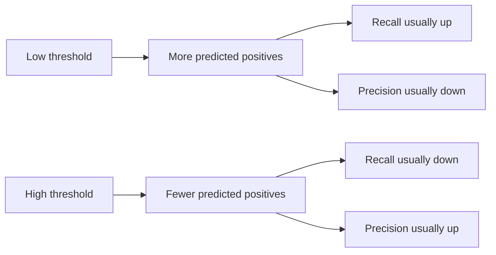

---
{"dg-publish":true,"permalink":"/software-engineering/11-ai-and-ml/machine-learning/evaluation/classification-evaluation/"}
---


# Intro

Classification evaluation is how you measure whether a model assigns the right label (or set of labels) for an input. In software terms: you want to quantify the failure modes (false alarms vs misses), pick an operating point (threshold), and prevent regressions when data/model changes.

## Precision Recall and F1 in one page

### Confusion matrix first

Everything starts from four counts:

| | Actual positive | Actual negative |
|---|---:|---:|
| Predicted positive | TP | FP |
| Predicted negative | FN | TN |

- `TP`: you flagged positive and it really was positive.
- `FP`: false alarm.
- `FN`: miss.
- `TN`: correctly ignored.

### The three formulas to remember

```text
precision = TP / (TP + FP)
recall    = TP / (TP + FN)
F1        = 2 * (precision * recall) / (precision + recall)
```

- Precision: from predicted positives, how many are truly positive.
- Recall: from real positives, how many you found.
- F1: one score that is high only when both precision and recall are high.

Memory hook:

- Precision is hurt by `FP` false alarms.
- Recall is hurt by `FN` misses.

### Threshold tradeoff



### Real world examples

Content moderation:

- Low threshold catches more unsafe posts, but blocks more safe posts.
- High threshold blocks fewer safe posts, but lets more unsafe posts pass.

Fraud detection:

- High recall means fewer fraud cases slip through.
- High precision means fewer legit users get flagged.

### Worked example

Binary classifier on 100 cases:

```text
TP = 32
FP = 8
TN = 50
FN = 10
```

```text
precision = 32 / (32 + 8)  = 0.80
recall    = 32 / (32 + 10) = 0.76
F1        = 2 * (0.80 * 0.76) / (0.80 + 0.76) = 0.78
```

Same model family at two thresholds:

| Threshold | TP | FP | FN | Precision | Recall |
|---|---:|---:|---:|---:|---:|
| 0.30 | 90 | 60 | 10 | 0.60 | 0.90 |
| 0.80 | 55 | 10 | 45 | 0.85 | 0.55 |

### Pitfalls

- F1 can hide which side is weak, so always inspect precision and recall separately.
- Comparing models at different thresholds is misleading unless threshold policy is fixed.
- Optimizing only precision or only recall can create unacceptable product behavior.

## Questions

> [!QUESTION]- When should I optimize precision first?
> Optimize precision first when false positives are expensive, for example blocking legit users or creating costly manual review load.

> [!QUESTION]- When should I optimize recall first?
> Optimize recall first when misses are dangerous, for example fraud, abuse, or safety violations slipping through.

> [!QUESTION]- How do I pick a threshold in practice?
> Pick a business constraint first, such as recall >= 0.95, then choose the threshold that maximizes the other metric under that constraint. Freeze it and run regression checks on the same golden set.

## Links

- [Scikit-learn: Classification metrics](https://scikit-learn.org/stable/modules/model_evaluation.html#classification-metrics)
- [Scikit-learn API: precision_recall_fscore_support](https://scikit-learn.org/stable/modules/generated/sklearn.metrics.precision_recall_fscore_support.html)
- [Google ML Glossary](https://developers.google.com/machine-learning/glossary)
- [Google ML Crash Course: Accuracy, precision, recall](https://developers.google.com/machine-learning/crash-course/classification/accuracy-precision-recall)

<!-- whats-next:start -->

---

> [!note] Whats next
> **Parent**
>  [[Software Engineering/11 AI & ML/Machine Learning/Machine Learning\|Machine Learning]]
>
> **Pages**
> - [[Software Engineering/11 AI & ML/Machine Learning/Evaluation/ROC-AUC and PR-AUC\|ROC-AUC and PR-AUC]]
<!-- whats-next:end -->
